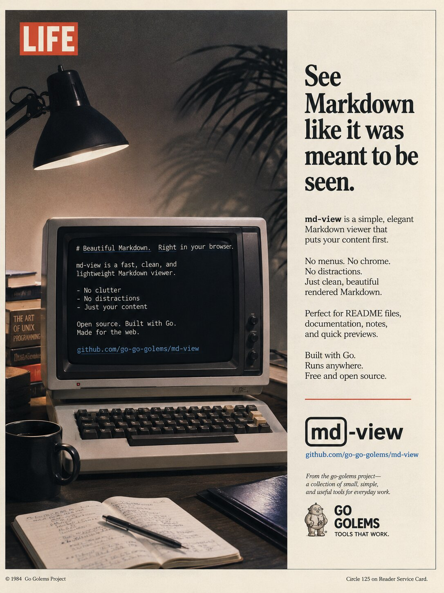

# md-view

<p align="center">
  
</p>

> A markdown viewer that just works. One command opens a native desktop window with beautiful rendering and live reload.

`md-view` is a **single native desktop application** built with [Wails v2](https://wails.io/). It renders Markdown files as GitHub-flavored HTML inside a platform-native window (WebKitGTK on Linux, WKWebView on macOS, WebView2 on Windows), with all rendering done in-process in Go. There is no daemon, no background server, and no browser tab — just one binary.

## 30-Second Quick Start

```bash
make build
build/bin/md-view view ./README.md
```

That's it. A native window opens showing the rendered Markdown. Edit the file, and the view refreshes automatically.

## Commands

| Command | What it does |
|---------|-------------|
| `md-view view <FILE>` | Open a markdown file in a native window |
| `md-view view --dark <FILE>` | Open it in dark mode |
| `md-view` (no args) | Open an empty window (also what double-clicking the binary does) |

> **Note:** md-view is now a desktop app, not a daemon. The old `serve`, `status`, and `stop` commands no longer exist — there is no background process to manage.

## Key Features

- **One command** — `md-view view file.md` opens a native window
- **Native desktop app** — a real window with a title (`md-view: <filename>`), not a browser tab
- **GitHub-flavored rendering** — tables, task lists, fenced code blocks, strikethrough
- **Syntax highlighting** — 200+ languages, rendered in-process via Chroma (no JS required)
- **Mermaid diagrams** — ` ```mermaid ` blocks rendered as SVG, works offline (mermaid.js is embedded)
- **Dark theme** — toggle button or `--dark` flag; code highlighting switches too
- **Live reload** — the view refreshes when the file changes on disk
- **Relative images** — `` resolves against the file's directory (served through an allow-listed handler)
- **Frontmatter support** — YAML frontmatter parsed into a collapsible key-value table; the `Title` field becomes the window title
- **Drag-and-drop** — drop a `.md` file onto the window to open it
- **Recent files** — a sidebar of recently opened files, persisted to `~/.config/md-view/recent.json`
- **reMarkable upload** — one click sends the current file to your reMarkable via `remarquee`
- **Copy / download** — copy a code block to the clipboard, copy the file path, or download the markdown
- **i3 / Sway ready** — windows are titled `md-view: <filename>`, just add a floating rule to your config

## Architecture

md-view is a single Wails v2 process. The CLI is just the launcher — there is no second process.

```
┌─────────────────────────────────────────────────────────────┐
│  Single native process: md-view                             │
│                                                             │
│  ┌──────────────┐    ┌──────────────┐    ┌──────────────┐   │
│  │ Cobra CLI    │───▶│ Wails runtime│───▶│  WebView     │   │
│  │ view [file]  │    │ (bound App)  │    │ (frontend)   │   │
│  └──────────────┘    └──────┬───────┘    └──────┬───────┘   │
│                             │                   │           │
│                             ▼                   │ events    │
│              ┌────────────────────────┐         │           │
│              │ pkg/renderer (RenderBody)│◀────────┘           │
│              │ pkg/watcher (fsnotify)  │                     │
│              └────────────────────────┘                     │
└─────────────────────────────────────────────────────────────┘
```

The rendering core (`pkg/renderer`) survived a rewrite from the earlier daemon-based design. The key change was extracting `RenderBody`, which returns a chrome-free HTML fragment that the stable frontend shell swaps into the window.

## Install

md-view is a CGO desktop binary (it links the system WebView). It is **not** installable via `go install` — build it from source, or use a native package once one is released.

**Build from source** (Linux requires `libwebkit2gtk-4.1-dev` + `libsoup-3.0-dev`):

```bash
git clone https://github.com/go-go-golems/md-view.git
cd md-view
make build            # produces build/bin/md-view
make install          # copies it next to the existing md-view, or to /usr/local/bin
```

**Native packages** (Homebrew / deb / rpm) are produced by GoReleaser on release; the build configuration is in `.goreleaser.yaml`.

## Documentation

- **[Getting Started](docs/getting-started.md)** — install, first view, common workflows
- **[User Guide](docs/user-guide.md)** — commands, flags, rendering, i3/Sway integration, troubleshooting

## Platform Notes

- **Linux:** requires `libwebkit2gtk-4.1-dev` and `libsoup-3.0-dev`. Build with `wails build -tags webkit2_41` (handled by `make build`).
- **Known limitation:** md-view wires Wails' `SingleInstanceLock` so a second `md-view view` would normally reuse the running window. On some Linux D-Bus setups the second invocation opens a new window instead. This is accepted behavior for now — each `md-view view <file>` reliably opens the file in a native window; deduplication to a single window is best-effort.

## Build from Source

```bash
git clone https://github.com/go-go-golems/md-view.git
cd md-view
make build
```

See [AGENT.md](AGENT.md) for the full set of build/test/lint commands.

## License

MIT
