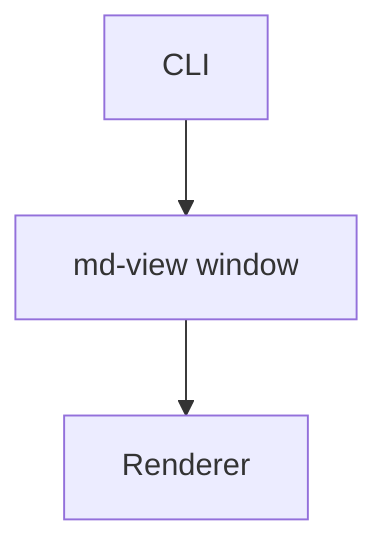

# Getting Started

Welcome to md-view — the fastest way to view a Markdown file in a native desktop window.

md-view is a **single Wails v2 desktop application**. It is not a daemon and it does not open a browser tab. One binary opens a platform-native window (WebKitGTK on Linux, WKWebView on macOS, WebView2 on Windows) and renders your Markdown in-process in Go.

## Install

md-view is a CGO desktop binary (it links the system WebView), so it is **not** installable via `go install`. Build it from source.

**Build from source** (Linux requires `libwebkit2gtk-4.1-dev` + `libsoup-3.0-dev`):

```bash
git clone https://github.com/go-go-golems/md-view.git
cd md-view
make build            # produces build/bin/md-view
```

Optionally put it on your `PATH`:

```bash
make install          # copies next to the existing md-view, or to /usr/local/bin/md-view
```

**Verify it works:**

```bash
md-view --help
```

## Your First View

```bash
md-view view ./README.md
```

What happens:

1. md-view parses the file argument.
2. A native desktop window opens with the title `md-view: README.md`.
3. The file is rendered as GitHub-flavored HTML inside the window.
4. The process stays alive until you close the window.

That's it. No daemon to start, no background process, no browser tab.

## Live Reload

Keep the window open. Edit the file in your editor. Save it.

The view refreshes automatically within about a second. md-view watches the open file with `fsnotify` and pushes a `file-changed` event straight to the window — there is no network hop and no manual reload.

## Dark Theme

Click the theme button in the top-right corner of the window, or launch in dark mode:

```bash
md-view view --dark ./README.md
```

The entire page switches — including syntax highlighting and Mermaid diagrams, which are re-rendered for the new theme. (Theme preference is kept in memory for the current session.)

## Mermaid Diagrams

Write Mermaid diagrams in fenced code blocks:

````markdown

````

md-view renders them as SVG diagrams automatically. Mermaid.js is embedded in the binary — no network required. Diagrams re-render with the correct theme when you toggle dark mode.

## View Multiple Files

Each `md-view view` opens a window for that file:

```bash
md-view view ./README.md
md-view view ./CHANGELOG.md
md-view view ./docs/api.md
```

md-view wires Wails' `SingleInstanceLock` so a second launch would normally reuse the existing window. On some Linux setups the second launch opens a new window instead — either way, every `md-view view <file>` reliably opens the file. (See the [User Guide](user-guide.md) for the full note.)

## Open Files Other Ways

Besides the command line, you can open a file by:

- **Menu:** File → Open… (`Ctrl/Cmd-O`) opens a native file dialog.
- **Drag-and-drop:** drop a `.md` file anywhere on the window.
- **Recent files:** the sidebar lists recently opened files; click one to reopen it.

Recent files are persisted to `~/.config/md-view/recent.json` (or the platform equivalent of `os.UserConfigDir()/md-view/`).

## Relative Images

Images referenced with a relative path resolve against the open file's directory:

```markdown

```

md-view serves these through an allow-listed handler (`/file/<abs-path>`), so they render in the window. Requests outside an opened file's directory are rejected with `403`.

## i3 / Sway Setup

All md-view windows have titles starting with `md-view:`. To make them float automatically, add to your i3 config (`~/.config/i3/config`):

```
for_window [title="^md-view:.*"] floating enable
```

Then reload:

```bash
i3-msg reload
```

Now every `md-view view` opens as a floating window. For Sway, use the same rule in `~/.config/sway/config` and `swaymsg reload`.

## What's Next?

- Read the **[User Guide](user-guide.md)** for the full command/flag reference, rendering details, i3/Sway integration, and troubleshooting.
- Try viewing a file with YAML frontmatter — md-view parses it into a collapsible table.
- Add `for_window [title="^md-view:.*"] floating enable` to your i3/Sway config.

## Quick Reference

```
md-view                       # Open an empty window
md-view view <FILE>           # View a file in a native window
md-view view --dark FILE      # View with dark theme
md-view --help                # Show help
```
