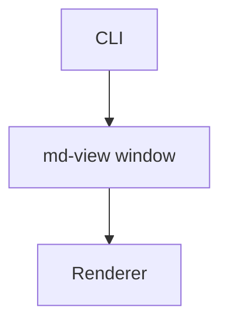

# md-view User Guide

Everything you need to know about md-view — commands, flags, rendering, integration, and troubleshooting.

---

## Table of Contents

- [Overview](#overview)
- [Commands](#commands)
  - [view](#view)
- [Rendering](#rendering)
  - [Markdown Features](#markdown-features)
  - [Syntax Highlighting](#syntax-highlighting)
  - [Mermaid Diagrams](#mermaid-diagrams)
  - [YAML Frontmatter](#yaml-frontmatter)
  - [Window Titles](#window-titles)
- [Dark Theme](#dark-theme)
- [Live Reload](#live-reload)
- [Opening Files](#opening-files)
- [Relative Images](#relative-images)
- [reMarkable Upload, Copy, and Download](#remarkable-upload-copy-and-download)
- [Recent Files](#recent-files)
- [Window Manager Integration](#window-manager-integration)
  - [i3 / Sway Integration](#i3--sway-integration)
- [Security](#security)
- [Troubleshooting](#troubleshooting)
- [Dependencies](#dependencies)

---

## Overview

md-view is a **single native desktop application** built with [Wails v2](https://wails.io/). It opens a platform-native window (WebKitGTK on Linux, WKWebView on macOS, WebView2 on Windows) and renders Markdown in-process in Go. There is no daemon, no background HTTP server, and no browser tab — just one binary that owns the whole lifecycle.

The command line is simply the way you launch the app and tell it which file to open.

```
┌─────────────────────────────────────────────────────────────┐
│  Single native process: md-view                             │
│                                                             │
│   Cobra CLI ──▶ Wails runtime (bound App) ──▶ WebView       │
│                        │                          ▲         │
│                        ▼                          │ events  │
│              pkg/renderer (RenderBody) ────────────┘         │
│              pkg/watcher (fsnotify)                          │
└─────────────────────────────────────────────────────────────┘
```

---

## Commands

### view

```bash
md-view view [FILE] [flags]
```

The primary command. Opens a Markdown file rendered as HTML in a native window.

**What it does:**

1. Parses the file path
2. Launches the Wails desktop window
3. Once the window's DOM is ready, renders the file and swaps the content in
4. The process stays alive until you close the window

**Arguments:**

| Argument | Required | Description |
|----------|----------|-------------|
| `FILE` | No | Path to the Markdown file to view (relative or absolute). Omit to open an empty window. |

**Flags:**

| Flag | Type | Default | Description |
|------|------|---------|-------------|
| `--dark` | bool | false | Open the file in dark mode |

**Examples:**

```bash
# View a file (simplest usage — opens a native window)
md-view view ./README.md

# Dark theme
md-view view --dark ./notes.md
```

### Bare launch

```bash
md-view            # no subcommand
```

Opens an empty window. This is also what happens when you double-click the `md-view` binary.

### What about `serve` / `status` / `stop`?

Those commands no longer exist. md-view used to be a background daemon plus a browser; it is now a single desktop binary, so there is no daemon process to query or stop. If you have scripts or muscle memory referencing them, replace `md-view view <file>` usage as-is (it still works) and drop any `serve`/`status`/`stop` calls.

---

## Rendering

### Markdown Features

md-view uses [goldmark](https://github.com/yuin/goldmark) with the GFM (GitHub-Flavored Markdown) extension. Supported features:

| Feature | Syntax | Example |
|---------|--------|---------|
| Tables | GFM pipe tables | `| A | B |` |
| Task lists | `- [ ]` / `- [x]` | `- [x] Done` |
| Strikethrough | `~~text~~` | `~~removed~~` |
| Fenced code blocks | ` ``` ` with language hint | ` ```go ` |
| Autolinks | Bare URLs | `https://example.com` |
| Hard wraps | End line with two spaces | Text↵↵next line |

### Syntax Highlighting

Code blocks are syntax-highlighted **in-process** using [Chroma](https://github.com/alecthomas/chroma) with the `github` style. Over 200 languages are supported — just add the language name after the backticks:

````markdown
```python
def hello():
    print("Hello, md-view!")
```

```go
func main() {
    fmt.Println("Hello, md-view!")
}
```
````

No JavaScript is required — highlighting is produced by Go at render time and emitted as CSS classes.

### Mermaid Diagrams

md-view renders [Mermaid](https://mermaid.js.org/) diagrams automatically. Write a fenced code block with the `mermaid` language tag:

````markdown

````

The diagram renders as an SVG directly in the window. Mermaid.js is **embedded in the md-view binary** — no network access is required.

**Supported diagram types:** flowchart, sequence, class, state, ER, Gantt, pie, mindmap, and more. See the [Mermaid documentation](https://mermaid.js.org/intro/) for syntax.

**Theme switching:** When you toggle the dark theme, Mermaid diagrams are automatically re-rendered with the corresponding theme (`default` for light, `dark` for dark mode).

**How it works:** goldmark renders ` ```mermaid ` blocks as fenced code. The frontend's augmentation pass converts these into rendered SVGs every time content is swapped into the window.

### YAML Frontmatter

If your Markdown file starts with YAML frontmatter (delimited by `---`), md-view:

1. **Strips it** from the rendered body
2. **Displays it** as a collapsible key-value table at the top of the page
3. **Uses the `Title` field** as the window title (if present)

Example frontmatter:

```yaml
---
Title: API Reference
Status: draft
Topics:
  - backend
  - api
---
```

The frontmatter appears as a collapsed `▶ Frontmatter` section. Click it to expand. Each key is on the left; each value is on the right. Nested values (lists, maps) are displayed as formatted text.

### Window Titles

The native window title is determined in this order:

1. **Frontmatter `Title`** — if the file has a `Title:` field in its frontmatter
2. **Filename** — the basename of the file (e.g. `README.md`)

All titles are prefixed with `md-view: ` for window-manager matching. Examples:

| File | Frontmatter Title | Window Title |
|------|------------------|---------------|
| `README.md` | (none) | `md-view: README.md` |
| `01-diary.md` | `Diary` | `md-view: Diary` |
| `api.md` | `API Reference` | `md-view: API Reference` |

---

## Dark Theme

md-view includes a full dark theme modeled after GitHub's dark mode. Two ways to activate it:

| Method | How |
|--------|-----|
| **Toggle button** | Click the theme button in the top-right corner of the window |
| **CLI flag** | `md-view view --dark file.md` |

### What changes in dark mode

- Page background, text, and link colors switch to dark variants
- Code blocks use a dark background with Dracula-style syntax highlighting
- Tables, blockquotes, and task lists use dark colors
- Frontmatter section uses dark borders and backgrounds
- Mermaid diagrams re-render with the `dark` theme

### Code highlighting in dark mode

Both light and dark Chroma CSS are always included. Dark rules are prefixed with `[data-theme="dark"]` selectors, so the toggle switches highlighting instantly without reloading content.

### Theme persistence

The theme is kept in memory for the current app session. Toggling updates all open content immediately. (Persisting the preference across launches is a planned follow-up.)

---

## Live Reload

When you view a file, md-view watches it for changes using [fsnotify](https://github.com/fsnotify/fsnotify). When the file is saved, the view refreshes automatically within about a second.

**How it works (no network involved):**

1. `pkg/watcher` registers an fsnotify watch on the open file
2. On a write event, the watcher signals a goroutine
3. The app emits a `file-changed` Wails event to the window
4. The frontend re-renders the current file and swaps the content in (re-running Mermaid and copy-button augmentation)

**Limitations:**

- Live reload watches the **currently open file's path**. Opening file B stops updates for file A until A is reopened.
- If the file is deleted and recreated (e.g. `git checkout`), the watch may be lost. Reopen the file.
- The watcher monitors the file itself, not the directory. Some editors that write to a temp file and rename may not trigger a reload.

---

## Opening Files

Besides the command line, you can open a file by:

- **Menu:** File → Open… (`Ctrl/Cmd-O`) opens a native file dialog.
- **Drag-and-drop:** drop a `.md` file anywhere on the window.
- **Recent files:** the sidebar lists recently opened files; click one to reopen it.

All of these route through the same render path, so the window title, live reload, and augmentation behave identically regardless of how the file was opened.

---

## Relative Images

Images referenced with a relative path resolve against the open file's directory:

```markdown

```

md-view rewrites relative `` to `/file/<absolute-path>` URLs and serves them through an allow-listed handler. Only the directory of an opened file (and what it links) is readable this way; everything else returns `403`. See [Security](#security).

---

## reMarkable Upload, Copy, and Download

The rendered window has a small toolbar of actions for the current file:

- **Upload to reMarkable** — sends the current file to your reMarkable device/cloud via the `remarquee` CLI.
- **Copy path** — copies the absolute path of the open file to the clipboard.
- **Download** — opens a native save dialog and writes the markdown source to the location you choose.

Code blocks also get a **copy-to-clipboard** button (revealed on hover).

---

## Recent Files

md-view remembers recently opened files in a JSON file:

- **Linux:** `~/.config/md-view/recent.json`
- **macOS:** `~/Library/Application Support/md-view/recent.json`
- **Windows:** `%AppData%/md-view/recent.json`

(These are the platform equivalents of `os.UserConfigDir()/md-view/recent.json`.)

The list is loaded on startup, prepended-to and deduplicated on each open, capped at 10 entries, and saved on shutdown.

---

## Window Manager Integration

### i3 / Sway Integration

All md-view windows have titles starting with `md-view:`. Add this to your i3 config (`~/.config/i3/config`):

```
for_window [title="^md-view:.*"] floating enable
```

For Sway, add to `~/.config/sway/config`:

```
for_window [title="^md-view:.*"] floating enable
```

Reload your config:

```bash
# i3
i3-msg reload

# Sway
swaymsg reload
```

After reloading, every `md-view view` opens as a floating window. This works because md-view is a real native window whose title you can match.

**Advanced: resize and center**

```
for_window [title="^md-view:.*"] floating enable, resize set 960 800, move position center
```

**Advanced: assign to a specific workspace**

```
for_window [title="^md-view:.*"] move container to workspace $ws3
```

**Advanced: set scratchpad (toggle with a keybinding)**

```
for_window [title="^md-view:.*"] move scratchpad
bindsym $mod+m scratchpad show
```

### Multiple windows

md-view wires Wails' `SingleInstanceLock` so a second `md-view view` would normally reuse the running window. On some Linux D-Bus setups the second invocation opens a **new window** instead of forwarding to the first. This is accepted behavior for now: every `md-view view <file>` reliably opens the file in a native window; deduplication to a single window is best-effort and may depend on your platform/D-Bus configuration.

---

## Security

md-view is a single-user local desktop tool. Security posture:

- **No network listener.** There is no HTTP server and no socket. The window is an embedded WebView served from in-process embedded assets.
- **Relative images via allow-list.** The `/file/<abs-path>` handler only serves paths inside the directory of an opened file. The prefix check includes a path separator, so `/tmp/foo` does not authorize `/tmp/foobar`. Anything outside an allowed directory returns `403`.
- **Local file access only.** Rendering and the reMarkable/download actions read the files you explicitly open. No remote fetching.

---

## Troubleshooting

### `wails build` vs `go build` — "will not build without the correct build tags"

A Wails production binary must be built with `wails build` (or `make build`, which wraps it). A plain `go build` omits Wails' build tags and the resulting binary refuses to start with:

```
Error: Wails applications will not build without the correct build tags.
```

Fix: always use `make build` (which runs `wails build -tags webkit2_41`).

### Missing webkit development libraries (Linux)

The Linux build links WebKitGTK and libsoup. Install the dev packages:

```bash
# Debian / Ubuntu
sudo apt install libwebkit2gtk-4.1-dev libsoup-3.0-dev

# Fedora
sudo dnf install webkit2gtk4.1-devel libsoup3-devel
```

Then `make build` again.

### The window opens but a second `md-view view` opens another window

That is the known Linux `SingleInstanceLock` limitation (see [Multiple windows](#multiple-windows)). Each window shows the correct file; if you want a single window, focus the existing one.

### Live reload doesn't fire

Some editors write to a temp file and rename, which can evade fsnotify. Try saving again, or reopen the file from the menu / recent-files sidebar. If the file was deleted and recreated (`git checkout`), reopen it to re-establish the watch.

### "command not found: md-view"

md-view is not on your `PATH`. Either run it directly (`build/bin/md-view view README.md`) or install it:

```bash
make install      # copies to the existing md-view location, or /usr/local/bin/md-view
```

### Build fails with CGO errors

md-view is a CGO binary (it links the system WebView). Make sure `gcc`/`g++` (and the webkit dev libs above) are installed, and that `CGO_ENABLED=1` (the Makefile sets this for you).

---

## Dependencies

| Package | Purpose |
|---------|---------|
| [Wails v2](https://wails.io/) | Desktop app framework (native WebView + Go bridge) |
| [cobra](https://github.com/spf13/cobra) | CLI command structure |
| [goldmark](https://github.com/yuin/goldmark) | Markdown → HTML conversion |
| [chroma](https://github.com/alecthomas/chroma) | Syntax highlighting |
| [fsnotify](https://github.com/fsnotify/fsnotify) | File watching for live reload |
| [logcopter](https://github.com/go-go-golems/logcopter) | Structured logging |
| [mermaid.js](https://mermaid.js.org/) | Diagram rendering (embedded, not a Go dependency) |
