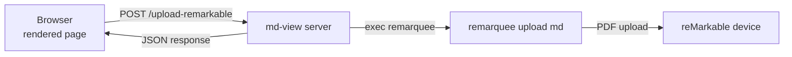

# reMarkable Upload Button Design

## Problem

md-view renders markdown files in the browser, but there is no way to send the current file to a reMarkable device. The user must switch to a terminal and run `remarquee upload md <file>` manually. Adding a button directly in the rendered page would streamline the workflow of previewing a document and then sending it to reMarkable for reading.

## Requirements

1. A button visible on every rendered page (similar to the dark theme toggle)
2. Clicking the button triggers `remarquee upload md <path>` on the server
3. The user gets visual feedback: uploading → success/error
4. The button should use the same fixed-position styling as the theme toggle
5. Must work with the existing daemon architecture (HTTP server + Unix socket)

## Architecture

The flow is straightforward:



### Backend: New HTTP endpoint

Add `POST /upload-remarkable` to the server that:

1. Reads `file` query parameter (same as `/render`)
2. Validates the file exists
3. Executes `remarquee upload md <file> --non-interactive` via `os/exec`
4. Captures stdout/stderr
5. Returns JSON response: `{status: "ok", message: "..."}` or `{status: "error", message: "..."}`

The endpoint runs the upload synchronously (blocking the HTTP response). This is fine because `remarquee upload md` for a single file typically completes in 5-15 seconds. The browser will show a loading state.

**Endpoint design:**

```
POST /upload-remarkable?file=/abs/path/to/file.md
```

Response (success):
```json
{"status": "ok", "message": "Uploaded to /ai/2026/05/29/file.pdf"}
```

Response (error):
```json
{"status": "error", "message": "remarquee: exit status 1: pandoc error..."}
```

Response (uploading — not used, just block):
```json
{"status": "ok", "message": "..."}
```

### Frontend: Upload button

Add a fixed-position button (like the theme toggle) that:

1. Shows a reMarkable tablet icon (simple SVG)
2. On click: POSTs to `/upload-remarkable?file=<path>`, shows loading spinner
3. On success: shows green checkmark + success message for 3 seconds
4. On error: shows red X + error message for 5 seconds

The button sits to the left of the theme toggle in the top-right corner.

### Implementation plan

#### Files to create/modify

| File | Change |
|------|--------|
| `pkg/server/server.go` | Add `POST /upload-remarkable` handler + route |
| `pkg/renderer/renderer.go` | Embed new `remarkable-button.js` + inject into HTML |
| `pkg/renderer/static/remarkable-button.js` | New file: button JS with SVG icons, fetch POST, state management |
| `pkg/renderer/static/base.css` | Add button styles (light theme) |
| `pkg/renderer/static/dark.css` | Add button styles (dark theme) |

### Security

The `/upload-remarkable` endpoint only accepts the `file` parameter, which must be an absolute path to an existing file. It does not accept arbitrary commands or shell injection — the file path is passed directly as an argument to `exec.Command("remarquee", "upload", "md", filePath, "--non-interactive")`.

### Error handling

- `remarquee` not found in PATH → error response
- File doesn't exist → error response
- Upload fails (auth, pandoc, network) → error response with stderr
- Success → ok response with remarquee stdout

### Tasks

1. Add `POST /upload-remarkable` handler in `server.go`
2. Create `remarkable-button.js` with SVG icons, fetch, and state management
3. Add button CSS to `base.css` and `dark.css`
4. Embed and inject the script in `renderer.go`
5. Test end-to-end
