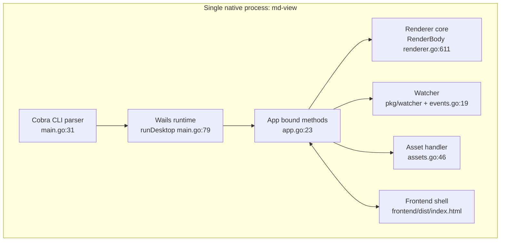
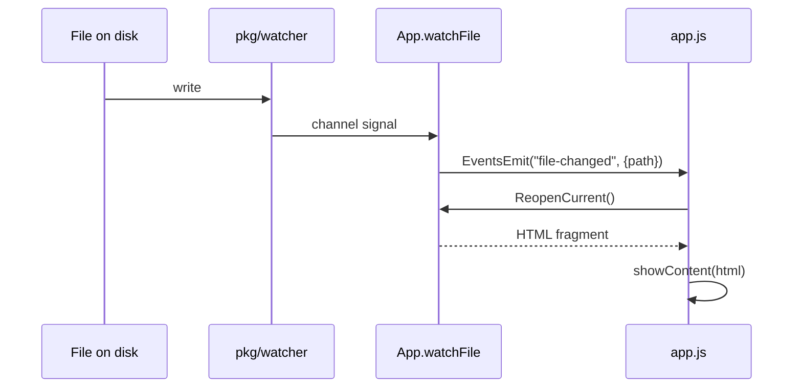

# Implementation Review and Lessons Learned

This document reviews the completed `md-view` rewrite from a daemon-driven browser application into a single Wails v2 desktop application. It is written for a new intern who needs two things at once: first, a clear mental model of the current system; second, a frank technical review of what went well, what did not go well, what the implementer should have known earlier, what tools and habits helped, and what should be learned next.

The point of this note is not to assign blame. The point is to preserve judgment. A future engineer should be able to read this and understand not just the code that now exists, but the engineering process that produced it, including the avoidable mistakes, the good instincts, the missing validations, and the parts of the work that are solid and should be copied in future projects.

The source repository is:

- `/home/manuel/code/wesen/2026-05-07--md-server`

The primary planning and implementation evidence lives in the MD-WAILS ticket:

- `ttmp/2026/06/13/MD-WAILS--port-md-view-to-a-wails-v2-desktop-application/design-impl-guide/01-wails-port-analysis-design-and-implementation-guide.md`
- `ttmp/2026/06/13/MD-WAILS--port-md-view-to-a-wails-v2-desktop-application/reference/01-investigation-diary.md`
- `ttmp/2026/06/13/MD-WAILS--port-md-view-to-a-wails-v2-desktop-application/sources/`

## Executive summary

The rewrite is technically successful.

`md-view` is now a **single Wails v2 desktop binary** with the following core properties:

- `md-view view <file> [--dark]` opens a native desktop window and renders the file
- the Markdown rendering pipeline is reused rather than rewritten
- the application supports live reload, relative image serving, Mermaid diagrams, frontmatter, dual-theme syntax highlighting, menus, drag-and-drop, recent files, code-copy buttons, download, and reMarkable upload
- the old daemon, Unix-socket protocol, PID/port/socket state files, HTTP server, and command-orchestration packages were deleted
- build, lint, and CI were repointed to the Wails build model

The rewrite is **not** perfect.

There are four major review findings an intern should internalize:

1. **The architecture simplification was excellent.** Preserving `pkg/renderer` and extracting `RenderBody` was the right technical center of gravity.
2. **The implementation sequencing was strong.** The work proceeded through small, verifiable phases with diary entries and focused commits, which reduced integration risk.
3. **Documentation discipline was mixed.** Internal ticket docs and diary work were excellent; user-facing docs (`README.md`, `docs/getting-started.md`, `docs/user-guide.md`) are still stale and still describe the deleted daemon/browser model.
4. **Platform-specific behavior was over-assumed at one important point.** Wails `SingleInstanceLock` was wired correctly by API, but on this Linux setup it did not deduplicate windows. That should have been de-risked earlier, before any architecture language depended on it.

The practical judgment is this:

- The code is good enough to build on.
- The implementation contains a number of strong engineering decisions worth reusing.
- The review work now needs to focus on closing the documentation gap, clarifying remaining limitations, and learning the platform-specific mechanics that were previously treated as assumptions.

## Review method

This review is based on three categories of evidence:

1. **Current code** in the repository after the cutover.
2. **Implementation history** in the MD-WAILS ticket diary and design documents.
3. **Behavioral verification** already performed during the implementation: build checks, tests, Playwright-on-Wails-dev smoke flows, recent-files persistence, image-serving allow-list checks, and reMarkable upload verification.

This document therefore reviews a real implementation state, not a hypothetical design.

## What the system is now

Before judging the work, an intern must understand the current system as it exists today.

### The new architecture at a glance

The old architecture had three moving runtime pieces:

- short-lived CLI
- background daemon
- browser

The new architecture has one:



The most important thing to notice is what disappeared:

- no daemon package
- no Unix socket protocol
- no PID/port/socket state files
- no internal HTTP server routes for `/render`, `/events`, `/raw`, or `/upload-remarkable`

Those behaviors still exist conceptually, but they now live behind bound Go methods and Wails events instead of HTTP endpoints.

### Current repo layout

A new intern should start with this map:

| File / area | Role |
|------------|------|
| `main.go` | Cobra root + `view` command + `wails.Run` + `SingleInstanceLock` wiring |
| `app.go` | Bound `App` surface: startup/shutdown, file open, theme, recent files, drag-drop, upload/download |
| `events.go` | live reload bridge: watcher channel → `file-changed` event |
| `assets.go` | `/file/<abs>` image-serving handler with allow-list |
| `menu.go` | File/View menus; callbacks emit events |
| `recent.go` | recent-files persistence and markdown-extension helpers |
| `cli.go` / `cli_test.go` | `ParseViewArgs` for startup and second-instance flows |
| `pkg/renderer/renderer.go` | Markdown rendering core; `RenderBody` and `Render` |
| `pkg/watcher/watcher.go` | fsnotify wrapper used for live reload |
| `frontend/dist/` | embedded frontend: HTML/CSS/JS shell and augmentation scripts |
| `Makefile` | build/test/dev/lint tasks after the Wails cutover |
| `.goreleaser.yaml` | release build configuration after the cutover |
| `AGENT.md` | developer-facing guidance, updated for Wails |

Deleted areas:

- `cmd/md-view/`
- `pkg/commands/`
- `pkg/daemon/`
- `pkg/protocol/`
- `pkg/server/`

### Current command path

The most important runtime path is now the startup path for `md-view view README.md`.

In pseudocode:

```go
func main() {
    rootCmd := cobra root
    viewCmd := cobra view subcommand
    rootCmd.Execute()
}

func runDesktop(file string, dark bool) error {
    app := NewApp()
    app.PendingOpen = file
    app.PendingDark = dark
    return wails.Run(&options.App{
        OnStartup: app.Startup,
        OnDomReady: app.OnDomReady,
        OnShutdown: app.Shutdown,
        Bind: []interface{}{app},
        AssetServer: frontend assets + ServeReferencedFile,
        Menu: buildMenu(app),
        DragAndDrop: EnableFileDrop,
        SingleInstanceLock: { UniqueId, OnSecondInstanceLaunch },
    })
}

func (a *App) OnDomReady(ctx context.Context) {
    if a.PendingOpen != "" {
        html := a.openPath(a.PendingOpen)
        emit file-opened(html, path, title)
    }
}
```

The architectural meaning of this path is important:

- the CLI no longer orchestrates a daemon
- the CLI simply launches the desktop application
- opening the file is deferred until the DOM exists

### Current rendering path

The rendering center is `RenderBody` in `pkg/renderer/renderer.go:611`.

That function is the surviving core of the old project.

It does this work:

1. read the markdown file from disk
2. extract YAML frontmatter
3. render Markdown with Goldmark + Chroma classes
4. rewrite relative image paths to `/file/<abs>`
5. resolve a title
6. return `{Frontmatter, Body, Title}` as a fragment structure

This split is the key refactor because the desktop frontend no longer wants a full page. It wants a stable shell and a swappable content fragment.

### Current frontend responsibilities

The frontend is a stable shell, not a page-per-file system.

That means it owns:

- toolbar and dropzone chrome
- theme application on `<html>` / `<body>`
- re-running augmentation after content swaps
- listening to Go-originated events

Important frontend anchors:

- `frontend/dist/app.js:106` — `showContent(html)`
- `frontend/dist/app.js:136` — `applyTheme(theme)`
- `frontend/dist/app.js:97` — `file-changed` event listener
- `frontend/dist/augment.js:112` — `window.MDSAugmentPage`
- `frontend/dist/augment.js:95` — `window.MDSMermaidRerender`
- `frontend/dist/buttons.js:40` — `window.MDSInitButtons`

A new intern should understand that `showContent` is the choke point. Every file-open path eventually lands there.

### Current live reload path

Live reload now goes through the watcher and Wails events, not SSE.



Important anchors:

- `events.go:19` — `watchFile(abs)`
- `app.go:204` — `ReopenCurrent()`
- `frontend/dist/app.js:97` — `runtime.EventsOn('file-changed', ...)`

### Current image-serving path

Relative Markdown images are served through the Wails asset handler.

Important anchors:

- `renderer.go:554` — `rewriteImagePaths(...)`
- `assets.go:46` — `ServeReferencedFile(...)`
- `assets.go:26` — `isAllowed(absPath)`
- `app.go:193` — `openPath` adds the containing directory to `allowedDirs`

The handler was behaviorally verified:

- rewritten `/file/tmp/md-img-test/images/diagram.png` returned 200
- `/file/etc/passwd` returned 403

### Current build path

This is one of the most important practical lessons in the project.

The production build must go through Wails:

```make
build: frontend-css
    wails build -tags webkit2_41 -s
```

Important anchors:

- `Makefile` — `build`, `frontend-css`, `wails-dev`
- `cmd/gen-chroma-css/main.go` — generated CSS for the frontend
- `.goreleaser.yaml` — root `main: .` and explicit Wails build tags
- `AGENT.md` — updated build commands

A raw `go build` is not enough for a runnable production Wails binary in this repo. That was an important implementation discovery.

## Review scorecard

The following table is the shortest honest summary of the engineering quality.

| Area | Assessment | Why |
|------|------------|-----|
| Architecture simplification | **Strong** | The daemon/socket/browser stack was removed cleanly without damaging the renderer core. |
| Preservation of working code | **Strong** | `pkg/renderer` and `pkg/watcher` were reused rather than rewritten. |
| Phase discipline | **Strong** | The work was decomposed into phases with verification and diary entries. |
| Verification quality | **Strong** | The implementation used build/test checks plus Playwright-on-Wails-dev smoke flows. |
| Platform assumption management | **Medium / weak** | `SingleInstanceLock` was assumed more than it was proven. |
| Build-system understanding | **Medium** | `wails build` vs `go build` was discovered during implementation instead of being de-risked up front. |
| Test coverage breadth | **Medium** | Renderer and CLI parsing are tested; asset/recent/menu/button paths rely more on smoke verification than unit tests. |
| User-facing documentation discipline | **Weak** | `README.md`, `docs/getting-started.md`, and `docs/user-guide.md` are still stale and describe the deleted daemon/browser model. |
| Commit hygiene | **Mostly strong** | Phase commits are focused and explanatory, but at least one commit message in the repo history (`20cdcd5 :sparkles: Add final dist?`) is not review-grade. |
| Release confidence | **Medium** | Local builds are verified; GoReleaser tags were inferred and should be validated in a dry run. |

That is the high-level judgment. The rest of the review explains why.

## What was done well

### 1. The right thing was preserved

The best technical decision in the entire project was **not** to rewrite the renderer.

A weaker implementation would have treated the move to Wails as a justification to rewrite everything. That would have created two problems:

- higher defect risk in the most feature-dense code
- loss of confidence in the semantics of frontmatter, image rewriting, code highlighting, and Mermaid

Instead, the implementation identified the true reusable asset — the rendering core — and extracted a better contract around it.

The addition of `BodyHTML` and `RenderBody` (`pkg/renderer/renderer.go:596`, `:611`) is the architectural center of the rewrite. It demonstrates good judgment because it changes the interface only as much as the embedding model requires.

That is a pattern worth copying in future refactors:

- isolate the part that is already semantically correct
- change only the transport and page-chrome assumptions around it
- preserve behavior while adapting the contract

### 2. The work was phased instead of improvised

The implementation was not done as one large edit. It was done in explicit phases with diary records and intermediate verification.

This was a good decision for three reasons:

1. it made architectural regressions visible early
2. it created a reviewable sequence rather than one opaque "big bang" diff
3. it let the implementer test each concept in isolation before layering the next one

For an intern, this is one of the most important engineering habits in the whole project. Large rewrites become safer when they are expressed as a sequence of verifiable invariants:

- window opens
- renderer fragment works
- CSS/theme work
- live reload works
- image handler works
- menus/recent work
- CLI launch path works
- cutover is clean
- final buttons work

This habit likely prevented several classes of compounded failures.

### 3. Verification was practical, not theoretical

The implementer used the Wails dev server's browser mode plus Playwright to verify behaviors that would otherwise be painful to exercise manually.

That was particularly effective for:

- `OpenFileAtPath` rendering
- Mermaid rendering to SVG
- computed-style checks for light/dark code colors
- live reload after on-disk edits
- image handler status codes
- recent-files persistence
- reMarkable upload path

This is strong engineering judgment. It uses the actual runtime surface rather than relying only on reasoning from code.

The most important verification style used here was this one:

- call a bound Go method
- assert concrete DOM or network-visible results
- verify exact state change

That is much more valuable than a vague "I clicked around and it looked fine."

### 4. The cutover removed real complexity

Deleting `pkg/daemon`, `pkg/protocol`, `pkg/server`, `pkg/commands`, and `cmd/md-view` was not just cleanup. It was the actual payoff.

This simplified:

- process model
- state model
- build surface
- CLI surface
- user mental model
- dependency graph

It also removed `glazed`, which was no longer serving the new architecture.

A rewrite that leaves the old scaffolding in place for sentimental reasons is harder to maintain. This implementation was willing to finish the job.

That is good.

## What was weak or incomplete

### 1. The user-facing docs are stale, and that is a serious issue

This is the biggest non-code weakness in the project.

The core repo docs still describe the deleted daemon/browser system.

Evidence:

- `README.md:9` — says md-view is "a lightweight daemon"
- `README.md:29-32` — still lists `serve`, `status`, `stop`
- `README.md:51-52` — still shows the old CLI → server → browser diagram
- `docs/getting-started.md:36-39` — describes checking/staring the background daemon and opening a browser window
- `docs/getting-started.md:102-109` — still documents `--browser` and `--no-browser`
- `docs/getting-started.md:131-147` — still documents `status` and `stop`
- `docs/user-guide.md:44` — still says md-view is a daemon + CLI combo
- `docs/user-guide.md:67-127` — still documents browser-specific flags and daemon flow
- `docs/user-guide.md:131-193` — still documents `serve`, `status`, `stop`
- `docs/user-guide.md:233` — still says highlighting is done on the server

This is not a cosmetic flaw. It is a product correctness flaw.

If a user or new intern reads the docs before the code, they will form the wrong model of the system. That means:

- wrong install/build instructions
- wrong commands
- wrong debugging expectations
- wrong architecture assumptions

A rewrite is not complete while the primary user-facing docs still describe the deleted architecture.

This should have been addressed immediately after the cutover, not left for later.

### 2. `SingleInstanceLock` was trusted earlier than it was verified

The implementation used the correct Wails API and captured the source-level evidence for it. That was good. But the actual Linux behavior was not confirmed until late.

What happened:

- the architecture and docs initially treated `SingleInstanceLock` as the mechanism that would preserve the daemon's single-instance "reuse window" behavior
- later testing showed that on this Linux setup, a second invocation opened a second window instead of forwarding to the first instance and exiting
- the user then explicitly relaxed the requirement, which made the limitation acceptable

The final state is acceptable because the user approved multiple windows. But as a review point, this is still important.

The lesson is precise:

> Do not let a platform-specific runtime feature become an architectural assumption before it has been validated on the target platform.

The implementation should have run the second-invocation test much earlier, before language like "this replaces the daemon's reuse behavior" hardened in the design narrative.

### 3. The Wails build/tag model should have been de-risked earlier

The project learned an important fact during implementation:

- a plain `go build` was not enough to produce a runnable Wails production binary
- `wails build` was required because Wails injects the relevant runtime tags

This was discovered in practice, which is good. But it should probably have been proven during Phase 0 or early Phase 1.

Why this matters:

- build-system truths affect every later phase
- CI and GoReleaser need the correct model
- interns and future maintainers will try `go build` unless explicitly told otherwise

The project corrected the build system, which is good. But this is a lesson in sequencing: build/release invariants should be locked down as early as possible.

### 4. The code still relies more on smoke checks than targeted unit tests in some subsystems

This is not a severe flaw, but it is worth noticing.

What is tested well:

- renderer behavior (`pkg/renderer/renderer_test.go`)
- CLI argument parsing (`cli_test.go`)

What is mainly verified through runtime smoke checks rather than focused unit tests:

- image-serving allow-list logic in `assets.go`
- recent-files persistence in `recent.go`
- menu event behavior in `menu.go`
- button-row rebuilding in `buttons.js`
- reMarkable upload method error handling in `app.go:249`

This is not unacceptable. The smoke verification was real and useful. But an intern should understand the tradeoff:

- smoke checks prove integrated behavior
- unit tests prove logic boundaries cheaply and repeatedly

For `assets.go` and `recent.go` in particular, a few small table-driven tests would improve confidence significantly.

### 5. The package-namespace decision was pragmatic but slightly inelegant

The bound `App` stayed in `package main` rather than moving to a separate desktop package.

This was done for a legitimate reason: Wails binding namespaces are simpler and more predictable with `window.go.main.App`, which allowed the demo frontend to be copied with minimal change.

This was a sensible implementation shortcut.

But an intern should still see the tradeoff clearly:

- **good:** simpler bindings, less frontend churn
- **less good:** more behavior concentrated in package `main`, weaker separation between entry point and application logic

This is not a wrong decision. It is a tradeoff that should be made consciously.

## What they should have known better

This section is intentionally direct.

### 1. User-facing docs must move with architecture

This is the clearest "should have known better" item.

If you delete the daemon, you cannot leave the README and guides teaching the daemon. That is not an optional cleanup. It is part of the change.

The project already had strong internal docs in the ticket. That shows the problem was not inability to write. The problem was prioritization. Internal clarity was prioritized over external correctness.

That should not happen again.

### 2. Platform-specific runtime features must be treated as hypotheses until proven

`SingleInstanceLock` was documented correctly and implemented correctly by API. But that is not the same as proving the feature works on the target system.

An engineer should have known to validate one of the highest-risk platform behaviors early:

- first launch
- second launch
- path forwarding
- exit behavior of instance #2
- window focus behavior

This is especially true when the feature is implemented in OS-specific runtime code (Linux D-Bus path inside Wails).

### 3. Build tooling deserves an early spike

The difference between `wails build` and `go build` is not obscure trivia. It is a release-path invariant.

An engineer doing a framework migration should test, very early:

- development build
- production build
- direct execution of the production binary
- CI/test compile path
- release build path

That should be a checklist item at the beginning of the project, not a surprise in the middle.

### 4. The docs update should have been an explicit phase in the implementation plan

The implementation plan had explicit phases for rendering, styling, live reload, images, CLI, cutover, and buttons. That was good.

It should also have had a concrete, blocking phase for:

- README replacement
- docs/getting-started replacement
- docs/user-guide replacement

Not because documentation is ceremonial, but because the project's public surface is now different.

### 5. Release engineering should have been validated, not only configured

The current `.goreleaser.yaml` was updated thoughtfully, but the review should note that it was reasoned into shape and not yet validated through a real release dry run in this transcript.

That means the release story is **plausible and likely correct**, but not fully closed with the same level of confidence as the runtime behavior that was actually exercised.

An intern should learn that changing release config is not the same as proving release behavior.

## What helped and should be reused

### The existing Wails article and captured sources

The project had unusually good source material:

- the existing Wails v2 deep-dive article in the vault
- the Wails demo repo
- captured ticket sources for `SingleInstanceLock` and Cobra/Wails usage

This kind of evidence-first preparation is worth repeating.

### The phased diary workflow

The implementation diary was not busywork. It preserved exactly the class of knowledge this review is now building on:

- what was tried
- what failed
- what was learned
- why a deviation happened
- what to validate later

An intern should study the diary as an engineering artifact, not just a project-management artifact.

### Browser-mode verification through `wails dev`

Using the Wails dev server plus Playwright to exercise bound methods was one of the strongest tactical choices in the entire implementation.

It avoided a common desktop-app testing trap: making native GUI interactions the only verification path.

This technique should be reused whenever the frontend is reachable in dev mode and exposes the same bound methods.

### The decision to keep the renderer pure

This is worth repeating because it is the highest-value design instinct in the project.

A pure rendering core made everything else easier:

- CLI launch path
- menu open
- drag-drop
- live reload
- image serving
- eventual export and upload paths

That decision reduced the blast radius of the rewrite.

## What the intern should learn next

This section is practical and concrete.

### Learn Wails from three angles

1. **Public API surface**
   - `options.App`
   - `SingleInstanceLock`
   - `runtime.*`
   - menus, dialogs, drag-and-drop, asset server

2. **Framework behavior on Linux**
   - `internal/frontend/desktop/linux/single_instance.go` inside the Wails module
   - D-Bus session bus basics
   - WebKitGTK build/runtime expectations

3. **Build/release behavior**
   - what `wails dev` does
   - what `wails build` injects
   - how GoReleaser differs from the Wails CLI path

### Learn the current repo in this order

If you are new to the codebase, read files in this order:

1. `main.go` — the startup and CLI path
2. `app.go` — the bound application surface
3. `pkg/renderer/renderer.go` — especially `RenderBody`, `rewriteImagePaths`, `UICSS`, `Render`
4. `frontend/dist/app.js` — `showContent`, `applyTheme`, event listeners
5. `frontend/dist/augment.js` and `buttons.js`
6. `assets.go`, `events.go`, `recent.go`, `menu.go`, `cli.go`
7. `Makefile`, `.goreleaser.yaml`, `AGENT.md`
8. only then read the stale `README.md` and docs, because they currently describe the old model

### Learn which parts are likely stable vs likely to change

Likely stable:

- `pkg/renderer/RenderBody`
- `pkg/watcher`
- image allow-list pattern in `assets.go`
- recent-files persistence model

Likely to change:

- `SingleInstanceLock` behavior / policy
- release packaging details
- user-facing docs
- theme persistence
- maybe package layout around `package main`

## Suggested follow-up tasks

For the next engineer, these are the highest-value follow-ups.

### 1. Rewrite the user-facing docs immediately

This should be the first post-review action.

Minimum set:

- `README.md`
- `docs/getting-started.md`
- `docs/user-guide.md`

They should describe:

- native window, not browser tab
- no daemon
- no `serve` / `status` / `stop`
- `wails build` / `make build`
- `md-view view <file> [--dark]`
- current known limitation: multiple windows may open on Linux because single-instance dedup is not reliable here

### 2. Add focused tests for non-renderer subsystems

Recommended tests:

- `assets.go` — allow-list path tests
- `recent.go` — push/dedup/cap/load/save tests
- maybe `buttons.js` and `augment.js` via Playwright fixture tests if frontend test infrastructure is worth adding

### 3. Decide the official stance on multiple windows

The user accepted it. That may be the final policy.

But the code and docs should say so clearly:

- either multiple windows are officially supported
- or single-instance remains a desired behavior with a documented Linux limitation

An undocumented half-position is worse than either explicit choice.

### 4. Run a real release dry run

Not just `make build`. A real release-path validation should include:

- `goreleaser` dry run or snapshot run
- artifact inspection
- startup of the produced binary
- install path sanity

### 5. Consider theme persistence

The current theme model is in-memory and runtime-driven. Persisting it next to recent files would complete the local-state story.

## Concrete review of the most important files

### `main.go` — good, concise, and now the right owner of startup

Important anchors:

- `singleInstanceID` — `main.go:25`
- `main()` — `main.go:31`
- `runDesktop(file, dark)` — `main.go:79`

What is good:

- startup responsibilities are concentrated in one place
- Cobra surface is small and appropriate
- build-time embed and runtime wiring are easy to audit

What is less good:

- the `SingleInstanceLock` policy is now only partially trustworthy on Linux
- this file now carries framework-level assumptions that deserve comments and tests

### `app.go` — strong central coordinator, but a little crowded

Important anchors:

- `type App` — `app.go:23`
- `Startup` — `app.go:53`
- `OnDomReady` — `app.go:77`
- `OnSecondInstanceLaunch` — `app.go:110`
- `OpenFile` — `app.go:151`
- `OpenFileAtPath` — `app.go:170`
- `ReopenCurrent` — `app.go:204`
- `UploadToRemarkable` — `app.go:249`
- `DownloadMarkdown` — `app.go:287`

What is good:

- all user-facing behaviors are easy to find
- the major state transitions are centralized

What is less good:

- the file is now large enough that splitting into logical files helped, but the `App` surface itself may eventually deserve a thinner facade over a more structured internal package

### `pkg/renderer/renderer.go` — the best part of the rewrite

Important anchors:

- `UICSS` — `renderer.go:137`
- `rewriteImagePaths` — `renderer.go:554`
- `BodyHTML` — `renderer.go:596`
- `RenderBody` — `renderer.go:611`
- `Render` — `renderer.go:675`

This file is the strongest subsystem because it reflects the clearest reuse story.

### `frontend/dist/app.js`, `augment.js`, `buttons.js` — good adaptation to the fragment model

Important anchors:

- `showContent` — `frontend/dist/app.js:106`
- `applyTheme` — `frontend/dist/app.js:136`
- `file-changed` listener — `frontend/dist/app.js:97`
- `MDSAugmentPage` — `frontend/dist/augment.js:112`
- `MDSMermaidRerender` — `frontend/dist/augment.js:95`
- `MDSInitButtons` — `frontend/dist/buttons.js:40`

The good decision here was to make augmentation **re-runnable**. That is exactly the right adaptation to a stable shell plus fragment swaps.

## Final judgment

The implementation is good.

Not perfect, but good.

It shows several characteristics that a new intern should admire and copy:

- preserve working subsystems
- phase the work
- verify through the real runtime surface
- delete obsolete infrastructure when the replacement is ready
- write down what failed and why

It also shows several things they should learn to do better next time:

- validate platform-specific assumptions earlier
- update public docs as part of the architecture change, not after it
- lock down build/release invariants earlier
- widen unit-test coverage around new infrastructure helpers

If you take the codebase as it exists now, it is a strong base for future work.

If you take the process as a lesson, the main thing to carry forward is this:

> Good rewrites do not come from rewriting more code. They come from identifying the stable core, changing the contracts around it carefully, verifying each phase in the real runtime, and finishing the job all the way through docs and build infrastructure.

That is what this project mostly did well, and where it still has room to mature.
