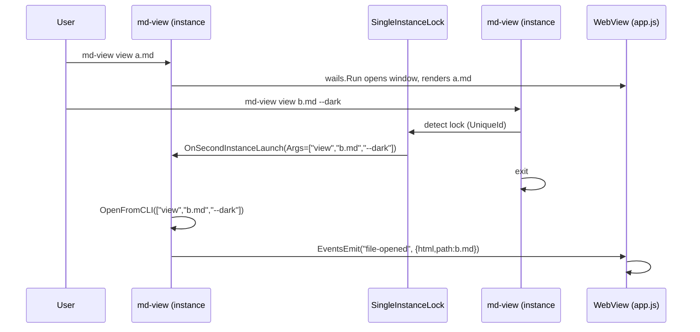
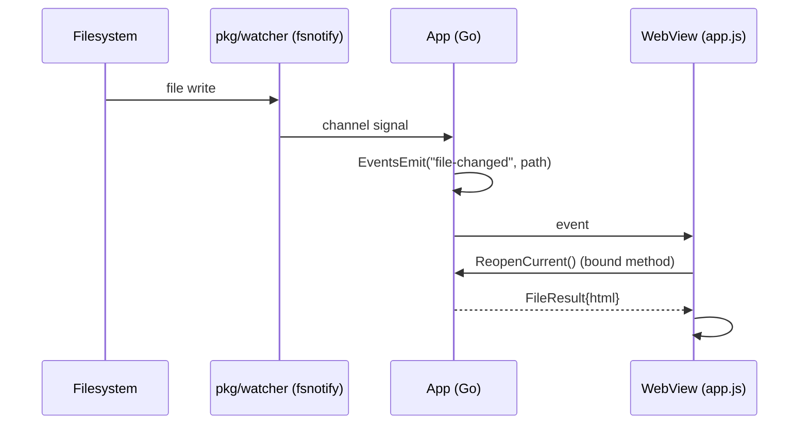

# Port md-view to Wails v2 — Analysis, Design and Implementation Guide

> **Who this is for.** This document assumes you can read and write Go, you understand HTTP and JSON, and you have used a browser. It does **not** assume you have ever seen the `md-view` codebase or the Wails framework before. Every subsystem is explained from first principles, then mapped to concrete files and line numbers you can open and read.
>
> **What it delivers.** A complete mental model of (1) what `md-view` is today, (2) what Wails is and how it works, (3) exactly how the two relate, (4) the architecture for a **drop-in Wails replacement** of the current md-view binary, and (5) a phased, file-level implementation plan you can execute one step at a time.
>
> **Scope note (revision 2).** This is a **replacement**, not a coexistence port. The deliverable is a **single binary** still called `md-view`, still invoked as `md-view view README.md`, that opens a native desktop window instead of a browser tab. The daemon, Unix-socket protocol, HTTP server, and PID/port/socket state files are **deleted**, not retained. A second `md-view view b.md` reuses the already-open window via Wails' built-in `SingleInstanceLock` (see `sources/01-wails-single-instance-lock-api.md`).

## Table of contents

1. [Executive summary](#1-executive-summary)
2. [Problem statement and scope](#2-problem-statement-and-scope)
3. [Part A — What md-view is today (current-state analysis)](#3-part-a--what-md-view-is-today-current-state-analysis)
4. [Part B — What Wails is and how it works](#4-part-b--what-wails-is-and-how-it-works)
5. [Part C — The proof-of-concept: the `2026-06-13--wails-demo` repo](#5-part-c--the-proof-of-concept-the-2026-06-13--wails-demo-repo)
6. [Gap analysis: mapping md-view features onto Wails](#6-gap-analysis-mapping-md-view-features-onto-wails)
7. [Proposed architecture for the Wails replacement](#7-proposed-architecture-for-the-wails-replacement)
8. [Decision records](#8-decision-records)
9. [Pseudocode and key flows](#9-pseudocode-and-key-flows)
10. [Implementation phases (file-level plan)](#10-implementation-phases-file-level-plan)
11. [Testing and validation strategy](#11-testing-and-validation-strategy)
12. [Risks, alternatives, and open questions](#12-risks-alternatives-and-open-questions)
13. [References](#13-references)

---

## 1. Executive summary

`md-view` is, today, a **daemon + HTTP server + browser** toolchain. You run `md-view view README.md`, a background process renders the Markdown to HTML, serves it over local HTTP, and your system browser opens the page. Live reload works through Server-Sent Events (SSE) pushed from an `fsnotify` file watcher. This works well, but it has consequences: it depends on a browser being installed, the window is a browser tab (not a first-class app window), state lives in PID/socket/port files under `~/.local/state`, and the process model is split across an ephemeral CLI, a long-lived daemon, and a separate browser.

This ticket **replaces** `md-view` with a **Wails v2** application — a Go framework that embeds a platform-native WebView (WebKitGTK on Linux, WKWebView on macOS, WebView2 on Windows) into a single Go process. The Go backend owns all business logic; a thin frontend (HTML/CSS/JS) renders the result. Go and JavaScript communicate through an **in-memory JSON bridge** — no HTTP server, no socket, no network.

Crucially, the replacement is **drop-in at the CLI**: the binary is still named `md-view`, and `md-view view README.md` still opens the file — but in a native window. A second `md-view view other.md` does not start a second app: Wails' built-in `SingleInstanceLock` (v2.7.0+) forwards the second invocation's command-line arguments to the already-running instance, which opens the new file in the existing window. This single mechanism **replaces the entire daemon + Unix-socket + PID/port/socket subsystem** (`pkg/daemon`, `pkg/protocol`, the orchestration in `pkg/commands/run.go`).

A working proof-of-concept already exists at `/home/manuel/code/wesen/2026-06-13--wails-demo` (`module github.com/example/markdown-viewer`). It demonstrates the three things that matter most for this port:

- A Go struct whose public methods are automatically callable from JavaScript.
- File open dialogs, drag-and-drop, and window menus driving the frontend through **events**.
- A Markdown → HTML pipeline that runs entirely in Go and is unit-testable without a GUI.

The replacement's job is to **keep md-view's rich renderer and reuse it inside a Wails shell**, replacing the daemon/HTTP/SSE/browser machinery with bound Go methods and Wails events, and the multi-invocation daemon with `SingleInstanceLock`. The renderer itself (`pkg/renderer/renderer.go`) is reused almost as-is; the daemon (`pkg/daemon`), protocol (`pkg/protocol`), the HTTP server's process plumbing (`pkg/server`), and the daemon-orchestration commands are **deleted**.

The result is a single ~15 MB binary named `md-view` that opens a real application window, with live reload, dark theme, syntax highlighting, Mermaid diagrams, frontmatter rendering, image loading, and a reMarkable upload button — all running in-process.

---

## 2. Problem statement and scope

### 2.1 The problem

The current `md-view` distribution model has three structural costs:

1. **Process sprawl.** A `view` invocation spawns (or reuses) a daemon, writes PID/port/socket files, sends a command over a Unix socket, and launches an external browser. There are three cooperating processes plus filesystem state. See `pkg/commands/run.go:25` (`RunView`) and `pkg/daemon/daemon.go`.
2. **Browser coupling.** The rendered output lives in the user's browser as a tab. Window management (i3/Sway floating rules, tab focus) is fragile and depends on `$BROWSER`/`xdg-open`/`firefox` being available. See `pkg/server/server.go:543` (`openBrowser`).
3. **State on disk.** PID, port, and socket files under `~/.local/state/md-view/` must be cleaned up, can go stale, and make "is it running?" a non-trivial question. See `pkg/daemon/daemon.go:20` (`StateDir`).

### 2.2 The CLI-compatibility contract (what "drop-in" means)

The replacement must preserve the primary user-facing command so existing muscle memory, scripts, and docs keep working:

| Invocation | Current behavior | Required behavior after the port |
|------------|------------------|----------------------------------|
| `md-view view README.md` | start/reuse daemon → render → open browser tab | open (or reuse) the desktop window and render `README.md` |
| `md-view view --dark README.md` | dark theme in the browser tab | dark theme in the window |
| `md-view view README.md` (while already running) | socket command to the daemon → new tab | `SingleInstanceLock` forwards args to instance #1 → opens the file in the existing window |
| `md-view` (bare) / double-click | (today: prints help) | open the app window (empty / last file) |
| `md-view serve` / `stop` / `status` | daemon-management verbs | **removed** — there is no daemon to manage. Document as a deliberate, benign breaking change. |

Flags like `--no-browser`, `--browser`, `--port` were daemon/browser-specific; they become no-ops or are removed (see DR-8). The `view` verb and the `--dark` flag are the compatibility surface that must not break.

### 2.3 In scope

- A **single** Wails v2 desktop application, binary named `md-view`, that **replaces** the current daemon/CLI/browser toolchain.
- **Drop-in `view` command**: `md-view view <file> [--dark]` opens the file in a native window; a second invocation reuses the window via `SingleInstanceLock`.
- Bound Go methods for: open file (dialog + by-path + from-CLI), theme toggle, recent files, file drop.
- Wails events replacing SSE for live reload (driven by the existing `fsnotify` watcher).
- Reusing the existing static assets (CSS, Mermaid, copy button, reMarkable button, toolbar buttons) via `go:embed`.
- Native menus, keyboard shortcuts, drag-and-drop, and window-title integration.
- **Deletion** of `pkg/daemon`, `pkg/protocol`, `pkg/server`, and the daemon-orchestration commands (`serve`/`stop`/`status` and the `RunView`/`ensureDaemonRunning` machinery in `pkg/commands/run.go`).

### 2.4 Out of scope (this ticket)

- Cross-platform packaging/installers beyond a basic `wails build` (Linux first; macOS/Windows as follow-ups).
- A fully rewritten frontend framework (React/Vue). The port keeps a vanilla-JS frontend, mirroring the demo.
- New rendering features (e.g. PDF export). Feature parity with the current renderer is the goal.
- Keeping the old daemon CLI as a separate binary (explicitly rejected — see DR-2).

---

## 3. Part A — What md-view is today (current-state analysis)

This part is a guided tour of the **existing** `md-view` codebase at `/home/manuel/code/wesen/2026-05-07--md-server`. Read it to understand what you are replacing. Every claim is anchored to a file and line range you can open.

### 3.1 Repository layout (the parts that matter)

```
cmd/md-view/main.go         CLI entry point (Cobra commands)
pkg/commands/               Cobra command definitions + orchestration (run.go, view.go, serve.go, status.go, stop.go)
pkg/daemon/daemon.go        PID / port / socket file management on disk            ← DELETED in the port
pkg/protocol/protocol.go    Unix-socket JSON request/response between CLI and daemon ← DELETED in the port
pkg/server/server.go        HTTP server: /render, /events (SSE), /static, /file, /upload-remarkable ← DELETED (logic reused)
pkg/renderer/renderer.go    Markdown → full HTML page (goldmark + chroma + mermaid + frontmatter) ← KEPT
pkg/renderer/static/        Embedded CSS + JS (base.css, dark.css, mermaid, copy-button, ...) ← KEPT
pkg/watcher/watcher.go      fsnotify wrapper that fans events out to SSE clients    ← KEPT
docs/                       User-facing documentation
```

The repository is a standard `go-go-golems` Go project: Cobra CLI built with the Glazed framework, `logcopter` structured logging, golangci-lint, GoReleaser, and `lefthook` hooks (see `Makefile`, `.goreleaser.yaml`, `AGENT.md`).

### 3.2 The command flow: `md-view view README.md`

The user types a command. Here is what happens, end to end — and what each step becomes in the Wails replacement.

```
┌──────────────┐  Unix Socket (JSON)  ┌──────────────────────┐   HTTP    ┌─────────┐
│  md-view CLI │ ─── "view" cmd ────► │  md-view daemon      │ ────────► │ Browser │
│  (ephemeral) │                      │  (long-lived server) │  ◄─ SSE ─ │  (tab)  │
└──────────────┘                      │                      │  reload   └─────────┘
                                      │  renders .md → HTML  │
                                      │  serves /static/*    │
                                      │  watches the file    │
                                      └──────────────────────┘
```

**Step 1 — Resolve and validate the file.** `RunView` (`pkg/commands/run.go:25`) resolves the path to absolute and stats it.

```go
absPath, err := filepath.Abs(s.File)      // run.go:30
if _, err := os.Stat(absPath); err != nil { ... }   // run.go:36
```

**Step 2 — Make sure the daemon is alive.** `ensureDaemonRunning` (`run.go:115`) checks `daemon.GetStatus()`. If nothing is running, it re-executes the current binary as `md-view serve` in the background, detached via `Setpgid: true` on Linux (`pkg/commands/daemon_linux.go`), and polls for the PID file to appear (`waitForPIDFile`, `run.go:167`).

**Step 3 — Talk to the daemon over a Unix socket.** Once the socket exists, `RunView` builds a `protocol.Command{Command:"view", Path: absPath, ...}` and sends it with `protocol.SendCommand` (`pkg/protocol/protocol.go`). The protocol is newline-delimited JSON over a Unix domain socket:

```go
type Command struct {
    Command string `json:"command"`           // "view" | "ping" | "stop"
    Path    string `json:"path,omitempty"`
    Dark    bool   `json:"dark,omitempty"`
    Browser string `json:"browser,omitempty"`
}
type Response struct {
    Status  string `json:"status"`            // "ok" | "error" | "pong"
    URL     string `json:"url,omitempty"`
    Message string `json:"message,omitempty"`
}
```
> `pkg/protocol/protocol.go:11` (Command) and `:27` (Response).

**Step 4 — The daemon handles the command.** `Server.handleSocketConn` (`server.go:178`) reads one JSON line, switches on `Command`, and for `"view"` builds a URL like `http://localhost:<port>/render?file=<path>[&theme=dark]`, then launches the browser (`server.go:543` / `openBrowserWith`).

**Step 5 — The browser fetches `/render`.** `Server.handleRender` (`server.go:253`) validates the file, registers its directory as "allowed" for image serving, calls `renderer.Render(absPath, opts)`, and writes the full HTML page.

**Step 6 — Live reload.** The rendered page includes a small script (`pkg/renderer/static/reload.js`) that opens an `EventSource` to `/events?file=<path>`. The server's `handleEvents` (`server.go:334`) registers the client with the `fsnotify` watcher; when the file changes, the watcher fires, the server writes an SSE `reload` event, and the browser reloads.

> **Why this matters for the replacement.** Steps 1–4 (CLI → socket → daemon → browser launch) **collapse into a single process**. The very first `md-view view` invocation starts the Wails app directly (no daemon, no socket, no re-exec). A *second* `md-view view` is caught by `SingleInstanceLock` and its `os.Args` are handed to instance #1 via `OnSecondInstanceLaunch` — the moral equivalent of Steps 2–4, but with no filesystem state. Step 5 becomes a bound Go method call. Step 6 (SSE) becomes a Wails event. The renderer used in Step 5 is reused wholesale.

### 3.3 The renderer: `pkg/renderer/renderer.go` (756 lines)

This is the **heart** of md-view and the asset you must preserve. It is a pure function from `(filePath, Options) → HTML string` with no GUI or network dependency, which is exactly what makes it portable to Wails.

**Signature and options** (`renderer.go:584`, `renderer.go:133`):

```go
type Options struct {
    NoReload bool   // disable SSE live reload injection
    File     string // absolute path (used for SSE endpoint + image resolution)
    Title    string // page title override
    Port     int    // HTTP port (used to build SSE + static URLs)
    Dark     bool   // initial theme
}

func Render(filePath string, opts Options) (string, error)
```

**The rendering pipeline** (inside `Render`, `renderer.go:584`):

1. **Read + split frontmatter.** `extractFrontmatter` (`renderer.go:158`) detects a leading `---\n...---` block, parses simple `key: value` YAML (`parseFrontmatter`, `:179`), and returns the body separately.
2. **Markdown → HTML with Goldmark.** Uses `goldmark` with the GFM extension and `goldmark-highlighting` (Chroma) producing class-based output:

   ```go
   md := goldmark.New(
       goldmark.WithExtensions(
           extension.GFM,
           highlighting.NewHighlighting(
               highlighting.WithStyle("github"),
               highlighting.WithFormatOptions(chroma_html.WithClasses(true)),
           ),
       ),
       goldmark.WithRendererOptions(html.WithHardWraps(), html.WithXHTML()),
   )
   ```
   > `renderer.go:606`–`:616`.

3. **Rewrite image paths.** `rewriteImagePaths` (`renderer.go:545`) turns relative `` into server-fetchable `/file/<abs-path>` URLs. This is the part that must change for Wails (see §6.7).
4. **Generate dual-theme Chroma CSS.** `ChromaCSSBoth` (`renderer.go:97`) emits light (`github`) CSS plus dark (`dracula`) CSS prefixed with `[data-theme="dark"]` so the toggle recolors code without re-rendering.
5. **Assemble the full page.** `Render` concatenates `defaultCSS`, `chromaCSS`, `themeCSS(opts.Dark)` (`renderer.go:282`), the frontmatter block (`formatFrontmatterHTML`, `:241`), the rendered body, the Mermaid init script, the reload script, and the copy/reMarkable/toolbar button scripts into one `<!DOCTYPE html>` document.

**Embedded assets** (`renderer.go:21`–`:42`): every CSS and JS file is compiled into the binary with `//go:embed`:

```go
//go:embed static/base.css
var defaultCSS []byte
//go:embed static/mermaid.min.js
var mermaidJS []byte
//go:embed static/reload.js
var reloadJS []byte
// ... copy-button.js, remarkable-button.js, toolbar-buttons.js, dark.css, mermaid-init.js
```

> **Key takeaway.** The renderer produces a *complete, self-contained HTML document* that is normally served by the HTTP server. Because `pkg/server` is being **deleted**, `Render`'s full-page assembler (which hardcodes a port into the SSE URL and references `/static/*` URLs) is no longer needed by the desktop app. We refactor it into a body-fragment renderer and let the frontend own the page chrome (DR-3).

**Frontend scripts today (what they do).** Each embedded script enhances the rendered page:

| File | Purpose |
|------|---------|
| `static/reload.js` | `MDSReloader(url)` — opens an SSE `EventSource` and reloads on `reload` events. |
| `static/copy-button.js` | Adds a clipboard button to every `<pre><code>` block. |
| `static/remarkable-button.js` | Adds a fixed button that POSTs to `/upload-remarkable?file=…`. |
| `static/toolbar-buttons.js` | Adds "copy path" and "download markdown" buttons. |
| `static/mermaid-init.js` | Finds `` ```mermaid `` blocks and renders them via embedded `mermaid.min.js`; re-renders on theme change. |

In Wails, the SSE-based reloader and the `fetch('/upload-remarkable')` call are replaced by **bound Go methods / Wails events**; the other scripts can be reused with minor URL adjustments.

### 3.4 The HTTP server: `pkg/server/server.go` (617 lines) — logic to reuse, package to delete

The server does five things. In the Wails replacement, each maps to a Go function called directly from the frontend (no HTTP). The package itself is **deleted**; its *logic* is re-implemented as small methods on `App`.

| HTTP route | Handler | Replaced in Wails by |
|------------|---------|----------------------|
| `GET /render?file=` | `handleRender` (`:253`) — render + return full HTML | `App.RenderFile(path)` bound method |
| `GET /raw?file=` | `handleRaw` (`:311`) — return raw markdown bytes | `App.RawFile(path)` (or omit; the toolbar "download" can call a bound method) |
| `GET /events?file=` | `handleEvents` (`:334`) — SSE live reload | Wails event `file-changed` emitted by the watcher |
| `GET /static/<asset>` | `handleStatic` (`:393`) — serve embedded CSS/JS | `go:embed` assets served by Wails' asset server, or inlined into the page |
| `GET /file/<abs-path>` | `handleFileServing` (`:418`) — serve referenced images | Wails `AssetServer.Handler` that resolves images relative to the open file |
| `POST /upload-remarkable?file=` | `handleUploadRemarkable` (`:472`) — shells out to `remarquee` | `App.UploadToRemarkable(path)` bound method |

### 3.5 The daemon and protocol: `pkg/daemon`, `pkg/protocol` — deleted

These two packages exist *only* to support the two-process model. The daemon writes state files (`daemon.go:58` `WritePID`, `:84` `WritePort`, `:110` `SocketPath`) and the protocol is a tiny JSON-over-Unix-socket RPC (`protocol.go`). **In the Wails replacement there is one process and `SingleInstanceLock` handles multi-invocation**, so:

- `pkg/daemon` → **deleted**. (Recent-files persistence moves to a tiny JSON file under `os.UserConfigDir()`, as the demo already does.)
- `pkg/protocol` → **deleted**. Frontend ↔ Go communication is the Wails bridge; CLI ↔ already-running-app communication is `SingleInstanceLock.OnSecondInstanceLaunch`.
- `pkg/commands` → the daemon-orchestration commands (`RunView`/`ensureDaemonRunning` in `run.go`, plus `serve`/`stop`/`status`) are **deleted**. Only a thin `view` command remains, and it now launches the GUI (see §9.1).

### 3.6 The file watcher: `pkg/watcher/watcher.go` (86 lines)

A small, clean wrapper around `fsnotify` that is **directly reusable** in Wails. `Watch(path)` returns a `<-chan struct{}`; `Start()` fans `fsnotify` write events to every subscriber for that path (`watcher.go:55`). In the replacement, a goroutine in `App.Startup` will range over this channel and call `runtime.EventsEmit(ctx, "file-changed", path)`.

---

## 4. Part B — What Wails is and how it works

If you have never used Wails, read this section once. It is the conceptual foundation for the whole replacement.

### 4.1 The three-layer model

A Wails application is one native process with three layers:

```
┌──────────────────────── Native Process ─────────────────────────┐
│                                                                  │
│  ┌─── Go Backend ───┐   ┌── Wails Bridge ──┐   ┌─ WebView ──┐   │
│  │ App struct       │   │ in-memory JSON   │   │ HTML/CSS/JS│   │
│  │ (bound methods)  │◄─►│ no HTTP, no net  │◄─►│ window.go  │   │
│  │ Runtime calls    │   │                  │   │ runtime    │   │
│  └──────────────────┘   └──────────────────┘   └────────────┘   │
└──────────────────────────────────────────────────────────────────┘
```

The Go backend owns **all** business logic. The frontend is a thin presentation layer. There is no HTTP server: the "bridge" is a function-call boundary that marshals arguments and results as JSON in memory.

### 4.2 The native WebView (per platform)

Wails does **not** bundle Chromium. It uses the OS's native web engine:

| Platform | Engine | Notes |
|----------|--------|-------|
| Linux | WebKitGTK | Needs `libwebkit2gtk-4.1-dev` + `libsoup-3.0-dev`; build with `-tags webkit2_41` |
| macOS | WKWebView | Same engine as Safari; built in |
| Windows | WebView2 (Chromium) | Pre-installed on Win 10/11 |

This is why a Wails binary is ~15 MB vs Electron's ~150 MB: there is no bundled browser.

### 4.3 The two communication channels

This is the single most important concept in Wails. There are **two** ways for Go and JavaScript to talk, and mixing them up is the #1 source of bugs.

**Channel 1 — Bound methods (JS → Go, request/response).**

Pass a struct to `options.App.Bind`. Wails scans it for **public methods** (capitalized first letter) and generates JS wrappers at `window['go']['<pkg>']['<Struct>']['<Method>']` that return a `Promise`.

```go
// Go
func (a *App) OpenFile() (string, error) { ... }
```
```javascript
// JS (auto-generated in frontend/wailsjs/go/main/App.js)
window['go']['main']['App']['OpenFile']().then(html => { ... });
```

**Channel 2 — Events (Go → JS and JS → Go, pub/sub).**

Use `runtime.EventsEmit(ctx, "name", data)` and `runtime.EventsOn("name", cb)`. Events are essential when **Go initiates** an action whose result must reach the DOM — most importantly, **menu callbacks** and the **single-instance CLI dispatch**.

> **The golden rule.** Menu callbacks run in Go. Go cannot touch the DOM. If a menu callback calls a bound method and discards the return value, the UI never updates. The correct pattern is: **menu callback → do work in Go → emit an event → frontend listens and updates the DOM.** The demo's `createMenu` (`main.go`) and `OnFileDrop` (`app.go`) both follow this rule.

### 4.4 The `context.Context` requirement

Every Wails runtime call (`OpenFileDialog`, `EventsEmit`, `WindowSetTitle`, …) needs the `context.Context` handed to `OnStartup`. **You must store it on a struct field.** Forgetting this is the most common startup panic.

```go
func (a *App) startup(ctx context.Context) { a.ctx = ctx }   // mandatory
```

### 4.5 Assets and `go:embed`

The frontend is embedded into the binary:

```go
//go:embed all:frontend/dist
var assets embed.FS
```

Wails serves these to the WebView. In `wails dev`, assets load from disk for hot reload; in `wails build`, they are baked in. This is the same `go:embed` mechanism md-view already uses for `static/*`.

### 4.6 The single-instance lock (the key to drop-in CLI)

Wails v2.7.0+ has a built-in `SingleInstanceLock` option (no external plugin). When a second process with the same `UniqueId` starts, Wails blocks it, calls `OnSecondInstanceLaunch` in the **first** process with the second process's `os.Args`, and then the second process exits. The exact API (captured in `sources/01-wails-single-instance-lock-api.md`):

```go
type SingleInstanceLock struct {
    UniqueId               string
    OnSecondInstanceLaunch func(secondInstanceData SecondInstanceData)
}
type SecondInstanceData struct {
    Args             []string   // == os.Args[1:] of the second process
    WorkingDirectory string
}
```

This is what makes `md-view view b.md` (run while the app is already open) open `b.md` in the existing window instead of starting a second app — the exact UX the current daemon provides, with **zero filesystem state**.

### 4.7 The build

```bash
wails dev   -tags "webkit2_41"     # hot-reload dev server
wails build -tags "webkit2_41"     # single ~15 MB binary
```

Wails generates TypeScript/JS bindings into `frontend/wailsjs/`, compiles the Go binary with `-ldflags="-s -w"`, embeds `frontend/dist`, and produces a self-contained executable.

---

## 5. Part C — The proof-of-concept: the `2026-06-13--wails-demo` repo

Before writing the replacement, study the demo at `/home/manuel/code/wesen/2026-06-13--wails-demo` (`module github.com/example/markdown-viewer`). It is a complete, minimal Wails Markdown viewer that proves every technique the replacement needs. It has four files of interest.

### 5.1 `main.go` — wiring

```go
//go:embed all:frontend/dist
var assets embed.FS

func main() {
    app := NewApp()
    err := wails.Run(&options.App{
        Title: "MarkDown Viewer", Width: 1024, Height: 768,
        AssetServer: &assetserver.Options{Assets: assets},
        OnStartup: app.startup, OnShutdown: app.shutdown,
        Menu: createMenu(app),
        Bind: []interface{}{app},            // expose App methods to JS
        DragAndDrop: &options.DragAndDrop{EnableFileDrop: true},
    })
}
```

Note: `Bind: []interface{}{app}` is what makes `OpenFile`, `ToggleTheme`, etc. callable from JS. The menu (`createMenu`) emits events; it never touches the DOM. **The replacement adds `SingleInstanceLock` to this same options struct** (§9.1).

### 5.2 `app.go` — the bound backend

`App` holds `ctx`, `currentFile`, `theme`, `recentFiles`. Its public methods are the frontend's API:

| Method | Returns | Purpose |
|--------|---------|---------|
| `OpenFile()` | `(string, error)` | Native file dialog → render → return HTML |
| `OpenFileAtPath(path)` | `(string, error)` | Render a specific path (drag-drop, recent files) |
| `GetCurrentFile()` | `string` | Current path |
| `GetRecentFiles()` | `[]string` | Recent paths (persisted to JSON) |
| `GetTheme()` / `ToggleTheme()` | `string` | Theme state |
| `OnFileDrop(x, y, paths)` | — | Drag-and-drop handler; emits `file-opened` |

Two things to copy verbatim:

- **Recent-files persistence** to `os.UserConfigDir()/markdown-viewer/recent.json` (`configPath`, `loadRecentFiles`, `saveRecentFiles`). This pattern **replaces** md-view's `pkg/daemon` state files.
- **The event pattern for file-opened** (`app.go` `OnFileDrop` / `openFileAtPath`):

  ```go
  runtime.EventsEmit(a.ctx, "file-opened", map[string]string{
      "html": html, "path": path, "title": filepath.Base(path),
  })
  ```

### 5.3 `render.go` — a *different* renderer

> **Important divergence.** The demo uses `gomarkdown/markdown` + `bluemonday`, while the production md-view uses `goldmark` + `goldmark-highlighting`. **Do not copy the demo's `render.go`.** The replacement keeps md-view's `pkg/renderer` (Goldmark) because it already supports GFM, Chroma class-based output, frontmatter, and Mermaid. The demo's renderer is only a structural reference.

What the demo's `render.go` *does* show is the right shape: a pure `func RenderMarkdown([]byte) (string, error)` that is unit-tested in `render_test.go` without any GUI. Your replacement keeps that property for `pkg/renderer.RenderBody`.

### 5.4 `frontend/dist/` — the vanilla-JS frontend

`index.html` has a toolbar, a dropzone, a content `<div>`, and a recent-files sidebar. `app.js` polls for `window.go` readiness, then wires buttons to bound methods and `runtime.EventsOn` listeners for `file-opened`, `file-error`, `theme-changed`, `close-file`. This is the template for the replacement's frontend, extended with md-view's CSS and button scripts, **plus** a new `open-from-cli` listener for the single-instance dispatch.

---

## 6. Gap analysis: mapping md-view features onto Wails

For each feature in the current md-view, the table states the gap and the resolution. "Reuse" means keep the code; "delete" means remove the package; "adapt" means keep the logic but change the wiring.

| Feature | Current implementation | Wails resolution | Effort |
|---------|------------------------|------------------|--------|
| Render Markdown → HTML | `pkg/renderer.Render` (Goldmark+Chroma) | **Reuse** (refactor into `RenderBody`, see DR-3) | Medium |
| Syntax highlighting | `ChromaCSSBoth` dual-theme CSS | **Reuse** as-is | Trivial |
| Mermaid diagrams | embedded `mermaid.min.js` + `mermaid-init.js` | **Reuse**; load from embedded assets | Trivial |
| Frontmatter block | `extractFrontmatter` + `formatFrontmatterHTML` | **Reuse** as-is | Trivial |
| Dark theme | CSS `[data-theme="dark"]` + toggle button | **Reuse** CSS; toggle via bound `ToggleTheme` + event | Small |
| Copy-to-clipboard buttons | `copy-button.js` | **Reuse** as-is | Trivial |
| reMarkable upload | `handleUploadRemarkable` (shells to `remarquee`) → `fetch` | **Adapt**: bound `App.UploadToRemarkable(path)`; JS calls it | Small |
| Toolbar (copy path / download) | `toolbar-buttons.js` using `/raw` | **Adapt**: bound `App.RawFile`/`App.DownloadMarkdown` | Small |
| Live reload | SSE `/events` + `reload.js` + `fsnotify` | **Replace SSE with Wails event**; **Reuse** `pkg/watcher` | Medium |
| Image loading | `/file/<abs>` handler + `rewriteImagePaths` | **Adapt**: `AssetServer.Handler` resolves images relative to open file (see §6.7) | Medium |
| File open (dialog) | N/A (browser tab) | **New**: `runtime.OpenFileDialog` (copy from demo) | Small |
| Drag-and-drop | N/A | **New**: `DragAndDrop.EnableFileDrop` + `OnFileDrop` (copy from demo) | Small |
| Recent files | none | **New**: JSON under `UserConfigDir` (copy from demo) | Small |
| Multi-invocation ("reuse running server") | daemon + Unix-socket `view` command + PID/port/socket files | **Replace** with `SingleInstanceLock.OnSecondInstanceLaunch` (DR-7) | Medium |
| `view` CLI command | `pkg/commands/view.go` + `run.go:RunView` → daemon | **Adapt**: `view` now parses args and calls `wails.Run` (first instance) or is forwarded (second instance) | Medium |
| `serve` / `stop` / `status` CLI commands | daemon-management verbs | **Delete** (no daemon). Benign breaking change. | — |
| `--browser` / `--no-browser` / `--port` flags | browser/daemon selection | **Delete** (no browser, no daemon). `--dark` stays. | — |
| `pkg/daemon`, `pkg/protocol`, `pkg/server` | process plumbing | **Delete** packages; reuse their *logic* in `App` | — |
| Window title | `md-view: <filename>` via browser tab | **New**: `runtime.WindowSetTitle` | Trivial |

### 6.7 Image loading — the trickiest adaptation

Today, a Markdown image `` is rewritten by `renderer.rewriteImagePaths` (`renderer.go:545`) to `/diagram.png">`, and `Server.handleFileServing` (`server.go:418`) serves it — with an allow-list of directories (`server.go:418`, the `allowedDirs` map) so arbitrary files can't be read.

Wails has no HTTP `/file/` route. Two options (see DR-5):

1. **`AssetServer.Handler`** — a Go `http.Handler` that Wails calls for every asset request that isn't an embedded file. Resolve the requested path against the open file's directory, check an allow-list, and `http.ServeContent` it. This keeps `rewriteImagePaths` almost unchanged (it can still emit `/file/...` paths, which the handler answers).
2. **`data:` URIs** — read each referenced image at render time and inline it as a base64 data URI. Simpler security story (no handler), but larger HTML and no lazy loading.

The design picks **Option 1** because it preserves the current `rewriteImagePaths` logic and the existing allow-list pattern, and it scales to large images and PDFs.

---

## 7. Proposed architecture for the Wails replacement

### 7.1 Target package layout

The Wails app **is** the `md-view` binary. There is no second binary and no `wailsapp/` subproject. The Wails project root is the repository root (`wails.json` lives next to `go.mod`); the Go entry point is the repo-root `main.go`, which replaces `cmd/md-view/main.go`. Wails conventionally expects `main.go` adjacent to `wails.json`; if you prefer to keep `cmd/md-view/main.go` as the entry, build via `wails generate module` + a manual `go build -tags webkit2_41 ./cmd/md-view` (see the Wails "Manual Builds" guide) — resolve this in Phase 0.

```
main.go                          # NEW entry: Cobra root + wails.Run + SingleInstanceLock (replaces cmd/md-view/main.go)
wails.json                       # NEW: Wails project config (outputfilename: md-view)
internal/desktop/                # NEW: the desktop application backend
├── app.go                       # App struct + bound methods (open, theme, recent, upload, from-CLI)
├── events.go                    # watcher goroutine → EventsEmit("file-changed"); handle "open-from-cli"
├── assets.go                    # http.Handler for /file/ image serving (AssetServer.Handler)
├── cli.go                       # parse view args (path, --dark) shared by first + second instance
└── frontend/
    ├── dist/
    │   ├── index.html           # page shell (toolbar, dropzone, content div)
    │   ├── app.js               # window.go calls + EventsOn listeners (incl. open-from-cli)
    │   ├── style.css            # layout (toolbar, dropzone, sidebar)
    │   ├── base.css             # MOVED/COPIED from pkg/renderer/static/base.css
    │   ├── dark.css             # from pkg/renderer/static/dark.css
    │   ├── chroma.css           # generated light+dark Chroma CSS (see DR-4)
    │   ├── mermaid.min.js       # from pkg/renderer/static/mermaid.min.js
    │   ├── mermaid-init.js      # from pkg/renderer/static/mermaid-init.js
    │   ├── copy-button.js       # from pkg/renderer/static/copy-button.js
    │   ├── remarkable-button.js # ADAPTED: call bound method instead of fetch
    │   └── toolbar-buttons.js   # ADAPTED: bound methods instead of /raw
    └── wailsjs/                 # auto-generated by wails dev/build
pkg/renderer/renderer.go         # KEPT — add RenderBody (DR-3); full-page Render assembler dropped or kept for HTML export
pkg/renderer/static/             # KEPT (assets are copied into frontend/dist at build)
pkg/watcher/watcher.go           # KEPT — reused directly
cmd/md-view/main.go              # DELETED (logic moves to repo-root main.go)
pkg/commands/                    # DELETED (serve/stop/status/run.go/view.go) — replaced by internal/desktop/cli.go
pkg/daemon/                      # DELETED — replaced by SingleInstanceLock + UserConfigDir JSON
pkg/protocol/                    # DELETED — replaced by the Wails bridge + OnSecondInstanceLaunch
pkg/server/                      # DELETED — logic reused in internal/desktop/app.go
```

### 7.2 Module / dependency strategy

One `go.mod` (per `AGENT.md`: *"Only use the toplevel go.mod, don't create new ones"*). Add `github.com/wailsapp/wails/v2`; keep `goldmark`, `chroma`, `fsnotify`. The Cobra/Glazed CLI deps are kept for the `view` command parsing. `pkg/renderer` and `pkg/watcher` are imported directly.

```go
import (
    "github.com/wailsapp/wails/v2"
    "github.com/wailsapp/wails/v2/pkg/options"
    "github.com/wailsapp/wails/v2/pkg/runtime"
    renderer "github.com/go-go-golems/md-view/pkg/renderer"
    "github.com/go-go-golems/md-view/pkg/watcher"
)
```

> Per the project's `generalGuidelines` (no adapters/shims without asking), the renderer is called directly. The one required refactor (splitting `Render` into a body-fragment helper — DR-3) is an internal change to `pkg/renderer`, not an adapter.

### 7.3 The App struct (the bound API)

```go
type App struct {
    ctx         context.Context
    currentFile string
    theme       string            // "light" | "dark"
    recentFiles []string
    watcher     *watcher.FileWatcher
    mu          sync.Mutex
    allowedDirs map[string]bool   // for image serving (mirrors server.go)
    pendingOpen string            // file requested before ctx is ready (from CLI/second-instance)
    pendingDark bool
}
```

Bound methods (all `public`, all return `(T, error)` or `T`):

```go
OpenFile() (FileResult, error)              // native dialog
OpenFileAtPath(path string) (FileResult, error)
OpenFromCLI(args []string) (FileResult, error)  // parse view args; used by 2nd-instance dispatch
ReopenCurrent() (FileResult, error)         // re-render current file (used by live reload)
GetCurrentFile() FileMeta
GetRecentFiles() []FileMeta
RemoveRecentFile(path string) []FileMeta
ToggleTheme() string
UploadToRemarkable(path string) (string, error)
RawFile(path string) ([]byte, error)        // for "download markdown"
OnFileDrop(x, y int, paths []string)        // drag-and-drop
```

`FileResult` and `FileMeta` carry the rendered HTML, path, title, and frontmatter, with `json` tags (Wails needs them for the generated TypeScript):

```go
type FileResult struct {
    HTML  string `json:"html"`
    Path  string `json:"path"`
    Title string `json:"title"`
}
type FileMeta struct {
    Path  string `json:"path"`
    Name  string `json:"name"`
    Title string `json:"title"`
}
```

### 7.4 The event model

| Event name | Emitted by | Listened by | Carries |
|------------|-----------|-------------|---------|
| `file-opened` | `OpenFile`, `OpenFileAtPath`, `OnFileDrop`, `OpenFromCLI`, menu File→Open | `app.js` | `{html, path, title}` |
| `file-changed` | watcher goroutine (`events.go`) | `app.js` | `{path}` → triggers `ReopenCurrent()` |
| `theme-changed` | `ToggleTheme`, menu View→Toggle Theme | `app.js` | `"light"|"dark"` |
| `file-error` | any render error | `app.js` | `{message}` |

The frontend's only job: call bound methods on user action, listen for events, and update the DOM. **Live reload** is `file-changed` → frontend calls `ReopenCurrent()` → sets `#content.innerHTML`. This replaces SSE + `reload.js`.

### 7.5 The single-instance CLI dispatch (replaces the daemon)



First instance: `main()` parses args; if it's the first run, it calls `wails.Run(...)` and stores the requested file as `pendingOpen` so `Startup`/`OnDomReady` opens it once the WebView is ready. Second instance: `SingleInstanceLock` fires `OnSecondInstanceLaunch` in instance #1 with `data.Args`; instance #1 calls `App.OpenFromCLI(data.Args)`, and instance #2 exits immediately.

### 7.6 Live reload without SSE



### 7.7 Image serving via AssetServer.Handler

The `App` maintains an `allowedDirs` set, populated exactly as `handleRender` does today (`server.go:286`–`:294`) when a file is opened. A custom handler resolves `/file/<path>` requests:

```go
AssetServer: &assetserver.Options{
    Assets:  assets,                 // embedded frontend
    Handler: http.HandlerFunc(a.ServeReferencedFile),
}
```

---

## 8. Decision records

### Decision DR-1: Keep the renderer; delete daemon/protocol/server

- **Context:** The replacement must not lose rendering fidelity, but the daemon/socket/HTTP plumbing is process-model-specific and has no analogue in a single-process Wails app.
- **Options considered:** (a) keep `pkg/server` and run the HTTP server inside Wails; (b) delete the three packages and call the renderer directly.
- **Decision:** (b). The Wails bridge replaces HTTP; the bound struct replaces socket commands; `SingleInstanceLock` replaces the daemon; `os.UserConfigDir()` JSON replaces PID/port/socket files.
- **Rationale:** The renderer is already a pure function (`Render(filePath, opts)`). Wrapping it in an HTTP server just to talk to a WebView in the same process adds a network hop for no benefit. The demo proves the direct-call model works.
- **Consequences:** `pkg/daemon`, `pkg/protocol`, `pkg/server`, and the daemon commands are **deleted**. Their *logic* (image allow-list, `remarquee` shell-out, watcher fan-out) is re-implemented as small methods on `App`. Tests under those packages are removed.
- **Status:** proposed

### Decision DR-2: Replacement, not coexistence — one binary named `md-view`

- **Context:** The user wants a drop-in replacement, not a second binary. The CLI must keep working.
- **Options considered:** (a) coexistence — ship `md-view` (CLI/daemon) **and** `md-view-desktop` (Wails); (b) replace — one Wails binary named `md-view` that is also the CLI.
- **Decision:** (b). A single binary that is both the CLI (`md-view view …`) and the desktop app. The daemon-management verbs (`serve`/`stop`/`status`) are removed because there is no daemon.
- **Rationale:** Two binaries split user attention and double the install/docs/CI surface. The Docker-Desktop-style "one app, also a CLI" model is a documented, supported Wails use case (see `sources/03-wails-cli-with-app-discussion-3098.md`), and Cobra + `wails.Run` coexist in one `main.go` (`sources/02-wails-cobra-integration-discussion-1271.md`).
- **Consequences:** `cmd/md-view/main.go` is replaced by a repo-root `main.go` (or the entry moves under `cmd/md-view/` with a manual build — resolve in Phase 0). GoReleaser builds one binary. Existing users' `serve`/`stop`/`status` invocations break (document it). The `view` verb and `--dark` flag are preserved.
- **Status:** accepted

### Decision DR-3: Refactor `Render` into `RenderBody` (fragment-first)

- **Context:** `Render` currently returns a *full HTML document* with `<html>`, `<head>`, inlined `<style>` and `<script>`, and an SSE reload script wired to a port. In Wails the WebView owns the page chrome, reload is an event (not a URL), and `pkg/server` (the only full-page consumer) is being deleted.
- **Options considered:** (a) keep `Render` returning full documents and load them via an asset handler; (b) split into a body-fragment renderer and let the frontend own the page.
- **Decision:** (b). Extract `RenderBody(filePath, opts) (*BodyHTML, error)` that returns frontmatter HTML + rendered body HTML + title. The frontend's `index.html` links the assets normally and swaps `#content.innerHTML`.
- **Rationale:** A stable page shell means theme toggling, asset caching, and Mermaid re-init are simpler (no full-page reload). It removes the port-specific SSE URL and the `/static/*` URL hardcoding. Since `pkg/server` is deleted, nothing else needs the full-page assembler.
- **Consequences:** `pkg/renderer` gets a small internal refactor; existing tests on `Render` are ported to `RenderBody`. The old full-page `Render` can be dropped, or kept as a thin `ExportHTML` helper if HTML export is wanted later (out of scope).
- **Status:** proposed

### Decision DR-4: Pre-generate Chroma CSS at build time, not per render

- **Context:** `ChromaCSSBoth` (`renderer.go:97`) regenerates CSS on every `Render`. For an HTTP server this is negligible; for a desktop app it is wasted work, and it complicates serving CSS as a static asset.
- **Options considered:** (a) keep generating per render and inline; (b) generate once via `go:generate` into `frontend/dist/chroma.css`.
- **Decision:** (b). Add a `go:generate`-driven generator (or tiny `cmd/gen-chroma-css`) that writes `ChromaCSSBoth()` output to `frontend/dist/chroma.css`, embedded and linked like the demo does.
- **Rationale:** Deterministic, cacheable, and matches the demo's `chroma.css` file. The renderer's `ChromaCSSBoth` helper is reused to *produce* the file.
- **Consequences:** A build step must run before `wails build`. Document in the Makefile (`make chroma-css`).
- **Status:** proposed

### Decision DR-5: Serve referenced images via `AssetServer.Handler`, keep `/file/` URLs

- **Context:** Relative `` must resolve against the open file's directory; security requires an allow-list.
- **Options considered:** (a) `AssetServer.Handler` resolving `/file/<path>`; (b) inline `data:` URIs at render time.
- **Decision:** (a). Reuse `renderer.rewriteImagePaths` (emit `/file/...`) and implement `App.ServeReferencedFile` mirroring `server.go:418` `handleFileServing` (allow-list + `http.ServeContent`).
- **Rationale:** Preserves existing logic, handles large images, and keeps the security model intact.
- **Consequences:** `App` owns an `allowedDirs` map (mirroring the server) populated on open. Path-traversal checks must be re-tested.
- **Status:** proposed

### Decision DR-6: Vanilla JS frontend, no framework

- **Context:** The demo uses plain HTML/CSS/JS. md-view's scripts are all vanilla JS.
- **Options considered:** (a) vanilla JS; (b) introduce React/Vue/Svelte.
- **Decision:** (a).
- **Rationale:** The UI is tiny (toolbar, content area, sidebar). A framework would add a build step and bundle size for no functional gain. Matches the demo and existing scripts.
- **Consequences:** `frontend/wailsjs/` bindings are called via `window['go']...` (demo's reliable pattern) to avoid module-script CORS quirks.
- **Status:** accepted

### Decision DR-7: Use Wails built-in `SingleInstanceLock` for multi-invocation

- **Context:** "Drop-in CLI" means a second `md-view view b.md` must reuse the open window, exactly as the daemon reused the running server today. Hand-rolling a socket/PID lock would re-introduce the very state files we are deleting.
- **Options considered:** (a) re-implement a Unix-socket lock + PID file (what md-view does today); (b) use Wails' built-in `SingleInstanceLock` (v2.7.0+).
- **Decision:** (b). Set `options.App.SingleInstanceLock = &options.SingleInstanceLock{UniqueId: "github.com/go-go-golems/md-view", OnSecondInstanceLaunch: app.OnSecondInstanceLaunch}`.
- **Rationale:** Built-in, no dependencies, no filesystem state, and it forwards the second process's `os.Args` directly to the first. It is the precise replacement for the daemon's "reuse running server" behavior. See `sources/01-wails-single-instance-lock-api.md`.
- **Consequences:** Requires Wails ≥ v2.7.0 (the demo pins v2.12.0, so satisfied). The second process must do **no irreversible work** before Wails hands off (it just parses args and exits). `UniqueId` must be stable and unique on the machine.
- **Status:** accepted

### Decision DR-8: Trim the `view` flags to the compatibility surface

- **Context:** `view` currently has `--browser`, `--no-browser`, `--port`, `--no-reload`, `--dark`. Most are daemon/browser-specific.
- **Options considered:** (a) keep all flags as no-ops; (b) keep only `--dark` (and the file argument).
- **Decision:** (b), but accept `--no-reload` as a no-op for script compatibility if cheap. Drop `--browser`/`--no-browser`/`--port` (they error or warn if passed).
- **Rationale:** A drop-in binary should keep the *primary* contract (`view <file> [--dark]`); silently accepting daemon flags invites confusion. Erroring on removed flags is clearer than silently ignoring.
- **Consequences:** Update `docs/user-guide.md` with the new flag set. Scripts passing `--port` will need updating (acceptable, documented breaking change).
- **Status:** proposed

---

## 9. Pseudocode and key flows

### 9.1 `main.go` — Cobra root + `wails.Run` + `SingleInstanceLock`

```go
package main

import (
    "embed"
    "log"
    "github.com/spf13/cobra"
    "github.com/wailsapp/wails/v2"
    "github.com/wailsapp/wails/v2/pkg/options"
    "github.com/wailsapp/wails/v2/pkg/options/assetserver"
    "github.com/wailsapp/wails/v2/pkg/runtime"
    "github.com/go-go-golems/md-view/internal/desktop"
)

//go:embed all:internal/desktop/frontend/dist
var assets embed.FS

var (
    viewFile string
    viewDark bool
)

// `md-view view <file>` (and bare `md-view`) both route here.
var viewCmd = &cobra.Command{
    Use:   "view [file]",
    Short: "View a markdown file in the md-view window",
    RunE: func(cmd *cobra.Command, args []string) error {
        if len(args) > 0 { viewFile = args[0] }
        return runDesktop(viewFile, viewDark)
    },
}

// Bare `md-view` opens the app with no file (or the last file).
var rootCmd = &cobra.Command{Use: "md-view"}
rootCmd.AddCommand(viewCmd)

func main() {
    // Default `view` when invoked as `md-view <file>` (drop-in shorthand)
    rootCmd.RunE = func(cmd *cobra.Command, args []string) error {
        if len(args) > 0 { return runDesktop(args[0], false) }
        return runDesktop("", false)
    }
    _ = rootCmd.Execute()
}

func runDesktop(file string, dark bool) error {
    app := desktop.NewApp()
    app.PendingOpen = file
    app.PendingDark = dark

    return wails.Run(&options.App{
        Title: "md-view", Width: 1024, Height: 768,
        MinWidth: 480, MinHeight: 360,
        AssetServer: &assetserver.Options{
            Assets:  assets,
            Handler: http.HandlerFunc(app.ServeReferencedFile), // /file/* images
        },
        OnStartup:  app.Startup,
        OnShutdown: app.Shutdown,
        Menu:       desktop.BuildMenu(app),
        Bind:       []interface{}{app},
        DragAndDrop: &options.DragAndDrop{EnableFileDrop: true},

        // The drop-in mechanism: a 2nd `md-view view b.md` forwards here.
        SingleInstanceLock: &options.SingleInstanceLock{
            UniqueId:               "github.com/go-go-golems/md-view",
            OnSecondInstanceLaunch: app.OnSecondInstanceLaunch,
        },
    })
}
```

> Note on the double-click gotcha from `sources/02-...`: a bare `md-view` (no subcommand) must still launch the GUI. The root `RunE` above guarantees that double-clicking the binary or running `md-view` with no args opens the window. Cobra is wired so the root command itself runs the app; `view` is an explicit alias.

### 9.2 Single-instance dispatch (`internal/desktop/events.go`)

```go
// Called by Wails in instance #1 when a second md-view starts.
func (a *App) OnSecondInstanceLaunch(data options.SecondInstanceData) {
    // data.Args == os.Args[1:] of the second process, e.g. ["view","b.md","--dark"]
    file, dark, ok := desktop.ParseViewArgs(data.Args)
    if !ok { return }
    if file == "" {
        runtime.WindowShow(a.ctx)   // just focus the existing window
        return
    }
    go func() { _, _ = a.openPath(file, dark) }()  // emits "file-opened"
}
```

### 9.3 `App.Startup` — wire the watcher and open the pending file

```go
func (a *App) Startup(ctx context.Context) {
    a.ctx = ctx
    a.loadRecentFiles()

    fw, _ := watcher.New()
    a.watcher = fw
    fw.Start()

    // Fan file-change signals into a Wails event the frontend listens for.
    go func() {
        for path, ch := range a.watchChannels() {
            go func(p string, c <-chan struct{}) {
                for range c {
                    runtime.EventsEmit(a.ctx, "file-changed", map[string]string{"path": p})
                }
            }(path, ch)
        }
    }()
}

// OnDomReady opens the file requested on the command line, now that the
// WebView can actually display it (ctx is set, DOM is ready).
func (a *App) OnDomReady(ctx context.Context) {
    if a.PendingOpen != "" {
        _, _ = a.openPath(a.PendingOpen, a.PendingDark)
        a.PendingOpen = ""
    }
}
```

### 9.4 `App.OpenFile` / `openPath` — the central bound method

```go
func (a *App) OpenFile() (FileResult, error) {
    path, err := runtime.OpenFileDialog(a.ctx, runtime.OpenDialogOptions{
        Title: "Open Markdown File",
        Filters: []runtime.FileFilter{
            {DisplayName: "Markdown", Pattern: "*.md;*.markdown;*.mdown;*.mkd"},
            {DisplayName: "All Files", Pattern: "*.*"},
        },
    })
    if err != nil { return FileResult{}, err }
    if path == "" { return FileResult{}, nil }   // user cancelled
    return a.openPath(path, false)
}

func (a *App) openPath(path string, dark bool) (FileResult, error) {
    abs, err := filepath.Abs(path)
    if err != nil { return FileResult{}, err }
    body, err := renderer.RenderBody(abs, renderer.Options{Dark: dark}) // see DR-3
    if err != nil { return FileResult{}, err }

    a.mu.Lock()
    a.currentFile = abs
    a.addAllowedDir(filepath.Dir(abs))     // mirror server.go:286 allow-list
    if _, ok := a.watchChans[abs]; !ok {
        ch, _ := a.watcher.Watch(abs)      // pkg/watcher.Watch
        a.watchChans[abs] = ch
    }
    a.mu.Unlock()

    a.pushRecent(abs)
    runtime.WindowSetTitle(a.ctx, "md-view: "+filepath.Base(abs))

    res := FileResult{HTML: body.HTML, Path: abs, Title: body.Title}
    runtime.EventsEmit(a.ctx, "file-opened", res)
    return res, nil
}
```

### 9.5 Live reload on the frontend (`app.js`)

```javascript
runtime.EventsOn('file-changed', (data) => {
    // Only re-render if the changed file is the one we're showing
    if (data.path === currentPath) {
        ReopenCurrent().then((res) => {
            document.getElementById('content').innerHTML = res.html;
            // re-run mermaid init + copy buttons against the new DOM
            window.MDSAugmentPage && window.MDSAugmentPage();
        });
    }
});
```

### 9.6 Image handler (`ServeReferencedFile`)

```go
func (a *App) ServeReferencedFile(w http.ResponseWriter, r *http.Request) {
    if !strings.HasPrefix(r.URL.Path, "/file/") {
        http.NotFound(w, r); return   // let Wails fall through to embedded assets
    }
    target := strings.TrimPrefix(r.URL.Path, "/file/")
    abs, _ := filepath.Abs("/" + target)             // mirror server.go:418
    a.mu.Lock()
    allowed := a.isAllowed(abs)                       // check allowedDirs
    a.mu.Unlock()
    if !allowed { http.Error(w, "forbidden", 403); return }
    f, err := os.Open(abs)
    if err != nil { http.NotFound(w, r); return }
    defer f.Close()
    st, _ := f.Stat()
    http.ServeContent(w, r, filepath.Base(abs), st.ModTime(), f)
}
```

> Wails calls the `Handler` only for requests not satisfied by embedded assets, so `/file/...` routes reach this function while `/app.js`, `/style.css`, etc. are served from `embed.FS`.

### 9.7 reMarkable upload — bound method replaces `fetch`

```go
func (a *App) UploadToRemarkable(path string) (string, error) {
    abs, err := filepath.Abs(path)
    if err != nil { return "", err }
    if _, err := os.Stat(abs); err != nil { return "", err }
    cmd := exec.Command("remarquee", "upload", "md", abs, "--non-interactive")
    var out, errb bytes.Buffer
    cmd.Stdout, cmd.Stderr = &out, &errb
    if err := cmd.Run(); err != nil {
        return "", fmt.Errorf("%s: %w", strings.TrimSpace(errb.String()), err)
    }
    return strings.TrimSpace(out.String()), nil
}
```

The adapted `remarkable-button.js` calls `window.go.desktop.App.UploadToRemarkable(filePath)` instead of `fetch('/upload-remarkable')`.

---

## 10. Implementation phases (file-level plan)

Each phase is independently shippable and testable. Do them in order. Phases 0–6 build the new app alongside the old code; **Phase 7 performs the cutover** (delete old packages, make the Wails binary the sole `md-view`).

### Phase 0 — Environment & scaffolding (½ day)

1. Install Linux deps: `sudo apt install libwebkit2gtk-4.1-dev libsoup-3.0-dev build-essential`.
2. Install the Wails CLI: `go install github.com/wailsapp/wails/v2/cmd/wails@latest`.
3. Verify: `wails doctor` (checks WebKitGTK, Go, Node).
4. Add `wails.json` at the repo root (`outputfilename: md-view`), `//go:embed all:internal/desktop/frontend/dist`, and a repo-root `main.go` with a minimal `wails.Run` (copy the demo's `main.go` shape). Create `internal/desktop/{app.go,events.go,assets.go,cli.go}` and `internal/desktop/frontend/dist/{index.html,app.js,style.css}`.
5. **Resolve the entry-point question** (DR-2): confirm `wails build` finds the repo-root `main.go`; if you must keep `cmd/md-view/main.go`, switch to `wails generate module` + manual `go build -tags webkit2_41 ./cmd/md-view`.
6. **Validate:** `wails dev -tags webkit2_41` opens a window showing the shell.

### Phase 1 — Reuse the renderer (1 day)

1. In `pkg/renderer/renderer.go`, add `RenderBody(filePath, opts) (*BodyHTML, error)` (DR-3) returning frontmatter HTML + body HTML + title.
2. Port `pkg/renderer/renderer_test.go` cases to `RenderBody`.
3. From `internal/desktop/app.go`, call `renderer.RenderBody` in `openPath`. Return a `FileResult`.

### Phase 2 — Assets, CSS, Chroma (½ day)

1. Copy `pkg/renderer/static/{base.css,dark.css,mermaid.min.js,mermaid-init.js,copy-button.js}` into `internal/desktop/frontend/dist/`.
2. Add a `go:generate`-driven `chroma-css` generator (DR-4) that writes `ChromaCSSBoth()` to `internal/desktop/frontend/dist/chroma.css`. Add `make chroma-css`.
3. Link all assets in `index.html` (like the demo).

### Phase 3 — Live reload via events (½ day)

1. `internal/desktop/events.go`: in `Startup`, start `pkg/watcher` and, per opened file, `Watch(path)` → goroutine → `EventsEmit("file-changed", path)`.
2. In `app.js`, `runtime.EventsOn('file-changed', …)` → `ReopenCurrent()` → swap `#content.innerHTML` → re-run augmentations.
3. **Validate:** with a file open, `echo "edit" >> file.md` updates the window within ~1s.

### Phase 4 — Image serving (½ day)

1. Implement `App.ServeReferencedFile` + `allowedDirs` (DR-5), mirroring `server.go:418`.
2. Keep `renderer.rewriteImagePaths` emitting `/file/<abs>` (it already does).

### Phase 5 — Menus, drag-and-drop, recent files, window title (½ day)

1. `BuildMenu(app)`: File (Open… Ctrl/Cmd-O, Close), View (Toggle Theme, Toggle Dark). Menu callbacks **emit events**.
2. `OnFileDrop(x,y,paths)`: pick first `.md`, call `openPath`, emit `file-opened`.
3. Port recent-files JSON persistence from the demo.
4. `WindowSetTitle` on open.

### Phase 6 — Single-instance CLI dispatch + `view` command (1 day)

1. Add `SingleInstanceLock` (DR-7) to `wails.Run` options; implement `OnSecondInstanceLaunch` → `ParseViewArgs` → `openPath` (or `WindowShow` if no file).
2. Wire the Cobra `view` command (§9.1): first instance calls `wails.Run` with `PendingOpen`; `OnDomReady` opens it. Bare `md-view` opens an empty window.
3. Trim flags per DR-8 (`--dark` kept; `--browser/--no-browser/--port` removed/error).
4. **Validate:** `md-view view a.md` then `md-view view b.md --dark` → second command reuses the window and shows `b.md` dark.

### Phase 7 — Cutover: delete old packages, single binary (1 day)

1. **Delete** `pkg/daemon`, `pkg/protocol`, `pkg/server`, `pkg/commands` (and `cmd/md-view/main.go` if the entry moved to repo root).
2. Remove the daemon commands from any registration; ensure `go build ./...` and `go test ./...` pass with only `pkg/renderer`, `pkg/watcher`, `internal/desktop`, and the root `main.go`.
3. Update `Makefile` (`build`/`dev` now use Wails; keep `test`/`lint`), `.goreleaser.yaml` (single `md-view` binary, build with `-tags webkit2_41`), and `.github/workflows`.
4. Update docs: `docs/user-guide.md` (new flags; note `serve`/`stop`/`status` removed), `README.md` (architecture diagram → single-process), `AGENT.md` (build commands).
5. **Validate:** `make build` produces one binary named `md-view`; `md-view view README.md` works end to end; CI green.

### Phase 8 — reMarkable + toolbar buttons (½ day)

1. Bound `UploadToRemarkable(path)`, `RawFile(path)`, `DownloadMarkdown(path)` (writes via `runtime.SaveFileDialog`).
2. Adapt `remarkable-button.js` and `toolbar-buttons.js` to call bound methods.

---

## 11. Testing and validation strategy

### 11.1 Unit tests (no GUI)

- `pkg/renderer`: `RenderBody` correctness — headings, GFM tables, fenced code with Chroma classes, frontmatter parsing/formatting, XSS sanitization (no `<script>`), `target="_blank"` on links, image-path rewriting. Mirror the demo's `render_test.go` style and the existing `renderer_test.go`.
- `pkg/watcher`: unchanged — already covered.
- `internal/desktop`: test the pure helpers (`ParseViewArgs` for `["view","b.md","--dark"]`; `pushRecent` dedup + cap at 10; `isAllowed` path checks; `configPath`).

### 11.2 Integration / smoke (with GUI, manual or Playwright-on-WebView)

- `md-view view a.md` → opens window, renders.
- `md-view view b.md` while running → **reuses window**, shows `b.md` (the single-instance test).
- Drag-and-drop → renders.
- Edit file on disk → live reload.
- Theme toggle → code colors switch.
- Mermaid block → SVG.
- Image → loads; forbidden path → blocked.
- reMarkable button → success toast.
- Bare `md-view` / double-click → opens window.

### 11.3 Security checks

- Confirm `<script>` never reaches the DOM (Goldmark + the page's CSP if added).
- Confirm `/file/` traversal (`/file/../../etc/passwd`) is rejected by `isAllowed`.
- Confirm `remarquee` is only invoked with a validated, existing path.

### 11.4 Acceptance criteria

- **One binary** named `md-view`, no external runtime deps (beyond the OS WebView).
- **Drop-in:** `md-view view <file> [--dark]` behaves as before (opens the rendered file), now in a native window.
- Second `md-view view` reuses the window (no second process lingers).
- Feature parity with the current renderer for the files in `pkg/renderer/testdata` and the repo's own `README.md`.
- `go test ./... -count=1` green; `make lint` green; no references to deleted packages remain.

---

## 12. Risks, alternatives, and open questions

### Risks

- **Wails project root vs `cmd/` entry.** `wails build` expects `main.go` next to `wails.json`. Keeping the go-go-golems `cmd/md-view/main.go` convention may require the manual-build path. Resolve definitively in Phase 0 (DR-2).
- **SingleInstanceLock edge cases.** A second process exits immediately after handoff; it must not write config or mutate state before Wails detects the lock. Test the timing of `OnSecondInstanceLaunch` vs. the first instance's `OnDomReady` (file may arrive before the window is ready — buffer in `PendingOpen`).
- **WebKitGTK version drift.** Ubuntu versions differ between 4.0 and 4.1. The `-tags webkit2_41` requirement is environment-specific; CI must pin a base image.
- **Mermaid in the WebView.** `mermaid.min.js` is large; confirm it loads from the embedded asset server and that `securityLevel: 'loose'` is acceptable in the desktop trust model.
- **Asset handler ordering.** Wails' `Handler` is a fallback to embedded assets; verify `/file/...` never collides with a real asset name.
- **macOS/Windows parity.** Path handling (`filepath.Abs`, leading-slash stripping in `/file/`) is Unix-shaped; Windows paths need testing (drive letters). `SingleInstanceLock` itself is cross-platform.
- **Breaking `serve`/`stop`/`status`.** Users/scripts calling these will get errors. Mitigate with a clear changelog and a deprecation note if a transition release is desired.

### Alternatives considered

- **Coexistence (two binaries).** Rejected (DR-2): the user explicitly wants a drop-in replacement.
- **Tauri (Rust).** Similar WebView model, but md-view is Go; Wails keeps one language.
- **Electron.** ~150 MB binaries and a Node runtime — rejected for size and the single-language goal.
- **Keep the HTTP server inside Wails.** Rejected (DR-1): redundant network hop in-process.
- **Hand-rolled socket/PID lock instead of `SingleInstanceLock`.** Rejected (DR-7): re-introduces the deleted state files for no gain.

### Open questions

1. Should theme preference persist? (Use the config-dir JSON, like the demo's recent files.)
2. Is a Content-Security-Policy needed in the WebView, given Goldmark is not sanitized with Bluemonday today? (Out of scope; worth a follow-up ticket.)
3. Should `--no-reload` be kept as a no-op for script compatibility? (DR-8 leans yes if cheap.)
4. Multi-window / multi-file support — the demo is single-window. Defer.

---

## 13. References

### 13.1 md-view (current) — `/home/manuel/code/wesen/2026-05-07--md-server`

| File | Key symbol | Line | Fate in the port |
|------|-----------|------|------------------|
| `pkg/renderer/renderer.go` | `Render` | 584 | **Kept**, refactored into `RenderBody` (DR-3) |
| `pkg/renderer/renderer.go` | `extractFrontmatter` / `parseFrontmatter` / `formatFrontmatterHTML` | 158 / 179 / 241 | Reused as-is |
| `pkg/renderer/renderer.go` | `ChromaCSSBoth` | 97 | Reused to generate static CSS (DR-4) |
| `pkg/renderer/renderer.go` | `rewriteImagePaths` | 545 | Reused (DR-5) |
| `pkg/renderer/renderer.go` | `//go:embed static/...` | 21–42 | Assets copied into `frontend/dist` |
| `pkg/server/server.go` | `handleRender` | 253 | **Package deleted**; allow-list logic copied into `App` |
| `pkg/server/server.go` | `handleEvents` (SSE) | 334 | Replaced by the `file-changed` event |
| `pkg/server/server.go` | `handleFileServing` | 418 | Logic reused in `ServeReferencedFile` (DR-5) |
| `pkg/server/server.go` | `handleUploadRemarkable` | 472 | Logic reused in `UploadToRemarkable` |
| `pkg/watcher/watcher.go` | `Watch` / `Start` | 38 / 55 | Reused directly |
| `pkg/daemon/daemon.go` | `StateDir` / `WritePID` / `SocketPath` | 20 / 58 / 110 | **Deleted** (SingleInstanceLock + UserConfigDir JSON replace it) |
| `pkg/protocol/protocol.go` | `Command` / `Response` | 11 / 27 | **Deleted** (OnSecondInstanceLaunch replaces it) |
| `pkg/commands/run.go` | `RunView` / `ensureDaemonRunning` | 25 / 115 | **Deleted** (the `view` command now calls `wails.Run`) |
| `cmd/md-view/main.go` | Cobra setup | 1–67 | **Deleted** (logic moves to repo-root `main.go`) |
| `Makefile` | build/test/lint | — | Rewired to Wails build |
| `AGENT.md` | project guidelines | — | Read first (go:embed as `embed`, `errors`, `errgroup`, `logcopter`) |

### 13.2 Wails demo (proof-of-concept) — `/home/manuel/code/wesen/2026-06-13--wails-demo`

| File | What to copy |
|------|--------------|
| `main.go` | `wails.Run` wiring, `go:embed all:frontend/dist`, `Bind`, `DragAndDrop`, menu |
| `app.go` | `App` struct, `startup`/`shutdown`, `OpenFile`, `OnFileDrop`, recent-files JSON persistence |
| `render.go` | **Structure only** — its `gomarkdown`+`bluemonday` pipeline is *not* used; md-view keeps Goldmark |
| `frontend/dist/index.html` | Page shell: toolbar, dropzone, content div, `/wails/runtime.js` |
| `frontend/dist/app.js` | `window.go` readiness polling, `EventsOn` listeners, button wiring |
| `frontend/wailsjs/go/main/App.js` | Example of auto-generated bindings (you will regenerate your own) |
| `wails.json` | Project config template |
| `go.mod` | Wails v2.12.0 + WebKitGTK transitive deps (reference for version pinning; v2.12.0 ≥ v2.7.0 so `SingleInstanceLock` is available) |

### 13.3 Captured sources (this ticket) — `sources/`

| File | What it proves |
|------|----------------|
| `sources/01-wails-single-instance-lock-api.md` | Built-in `SingleInstanceLock`/`SecondInstanceData` API (verbatim from `pkg/options/options.go`) — the drop-in mechanism (DR-7) |
| `sources/02-wails-cobra-integration-discussion-1271.md` | Cobra + `wails.Run` coexist in one `main.go`, with the double-click-vs-CLI gotcha |
| `sources/03-wails-cli-with-app-discussion-3098.md` | "One binary, CLI + GUI" is a documented Wails use case (Docker Desktop model) |
| `sources/00-sources-index.md` | Index of captured reference materials |

### 13.4 Background reading

- **Wails v2 deep dive** — `/home/manuel/code/wesen/go-go-golems/go-go-parc/Projects/2026/06/13/ARTICLE - Wails v2 Desktop Applications - Technical Deep Dive.md`. Read this for the bridge internals, the `context.Context` rule, the "menu callbacks must emit events" rule, and the Linux `-tags webkit2_41` build notes.
- **Wails docs** — https://wails.io/docs ; especially "Guides" (Menus, Dialogs, Single Instance Lock, File Association), "Reference" (Runtime, Options, AssetServer), and "Manual Builds".
- **md-view user docs** — `docs/getting-started.md`, `docs/user-guide.md` (to mirror feature behavior, then update for the new flags).

### 13.5 Glossary

- **Bound method** — a public Go struct method exposed to JS as a Promise-returning function.
- **Bridge** — Wails' in-memory JSON call layer between Go and the WebView.
- **Event** — pub/sub message via `runtime.EventsEmit`/`EventsOn`.
- **WebView** — the OS-native web engine (WebKitGTK/WKWebView/WebView2).
- **SingleInstanceLock** — Wails built-in (v2.7.0+) that ensures one app instance and forwards a second invocation's `os.Args` to the first.
- **AssetServer.Handler** — a Go `http.Handler` Wails consults for asset requests not found in the embedded `embed.FS`.
- **SSE** — Server-Sent Events; the current live-reload transport, replaced by Wails events.
